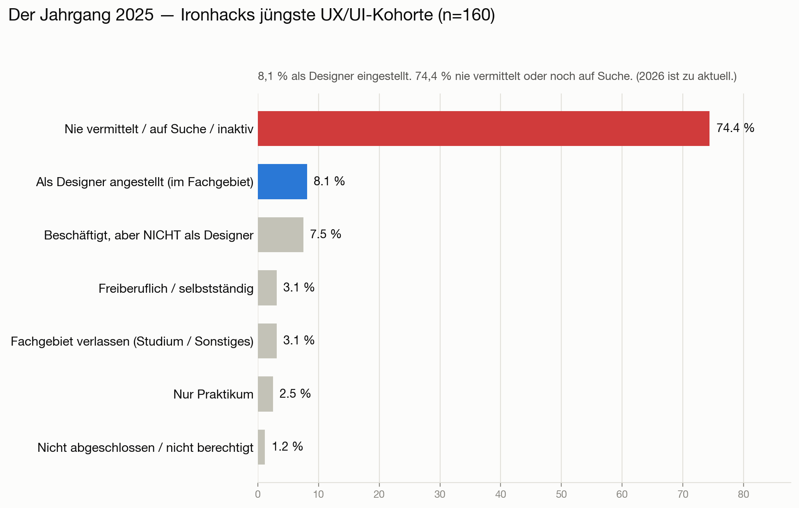
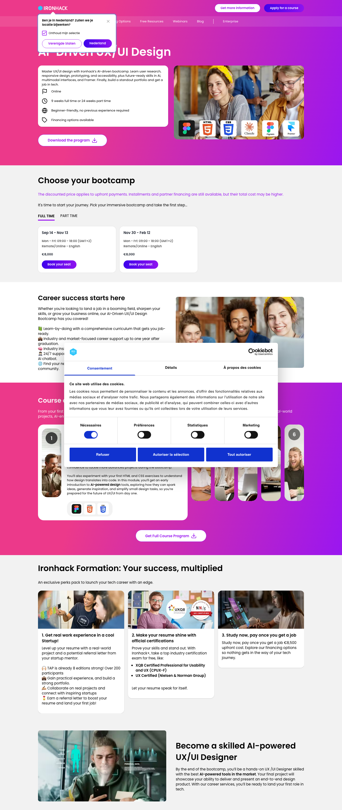
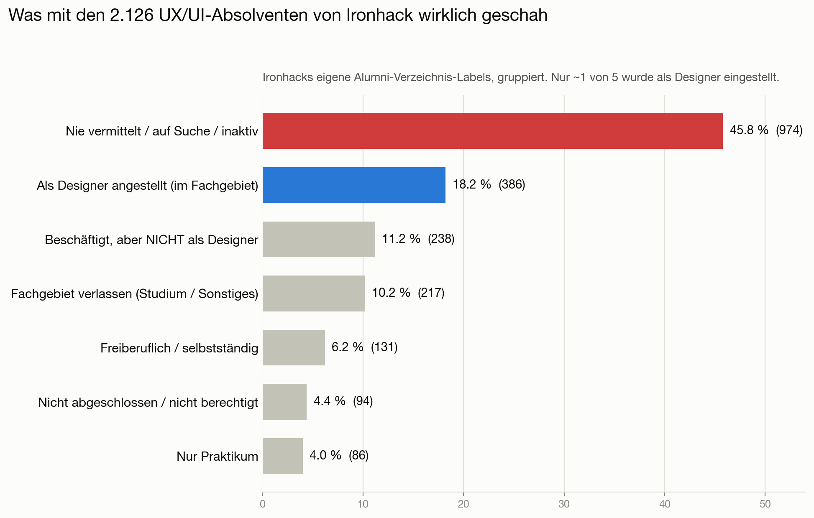
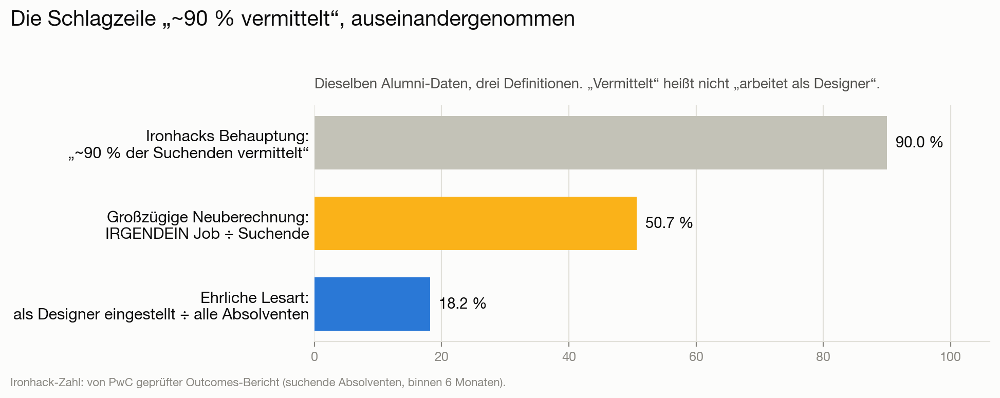
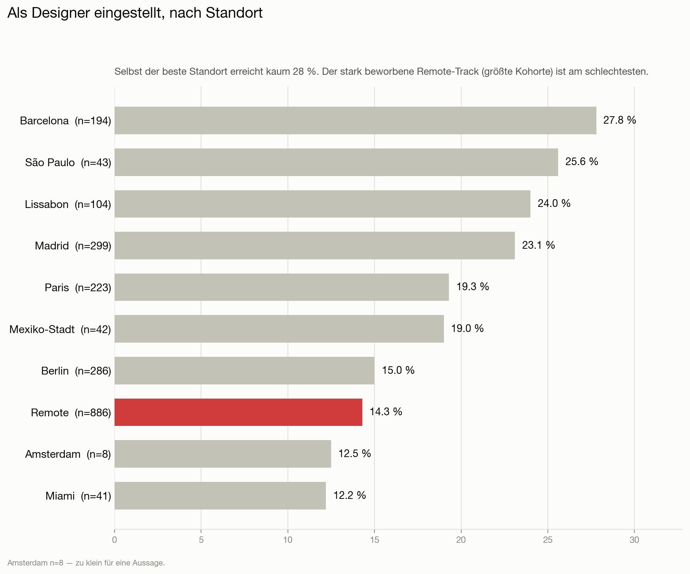
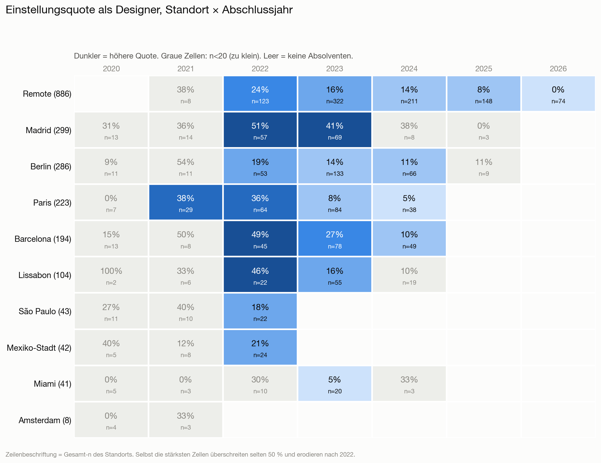

# Macht ein Ironhack UX/UI-Bootcamp dich zum „gut bezahlten UX-Designer"?

[English](README.md) · [Français](README.fr.md) · 🌍 **Deutsch** · [Português](README.pt.md)

**Ein datenbasierter Blick auf die Ergebnisse, die Ironhack selbst veröffentlicht.**

Ironhack bewirbt sein UX/UI-Bootcamp über Vermittlung: *„~90 % der arbeitsuchenden Absolventen binnen 6 Monaten vermittelt"* (von PwC geprüft), *„96 % Abschlussquote"*, samt Gehaltsbotschaften rund um eine UX/UI-Karriere. Dieses Repository prüft dieses Versprechen anhand von **Ironhacks eigenem Alumni-Verzeichnis** — dem internen Networking-/Recruiting-Verzeichnis, das eingeloggte Alumni auf `my.ironhack.com` sehen, über alle UX/UI-Absolventen aller 10 Standorte — und das Bild ist ein ganz anderes.

> **Ein Datenjournalismus-Projekt auf Basis von Ironhacks eigenem Datenbestand.** Die Quelle ist keine kuratierte Marketingseite, sondern Ironhacks **internes Alumni-Verzeichnis**, in dem das Vermittlungsergebnis jedes Absolventen erfasst wird (Zugang über ein Alumni-Konto). Gerade weil es der interne Datensatz und keine Schauvitrine ist, enthält es das **gesamte Spektrum der Ergebnisse, Misserfolge inklusive** — nichts ist herausgefiltert. Alle Ergebnisse hier sind **aggregiert und anonym**: niemand wird namentlich genannt, keine personenbezogenen Rohdaten werden erneut veröffentlicht. Es ist **keine** Betrugsbehauptung: Es zeigt die Distanz zwischen einem *Marketing-Eindruck* („werde Designer") und dem *typisch dokumentierten Ergebnis*, wobei Ironhacks eigene Statuslabels wörtlich genommen werden.

---

## ⚠️ Jüngster Jahrgang mit Daten — der Abschlussjahrgang 2025

> **Von den 160 UX/UI-Absolventen des Jahres 2025 wurden nur 8,1 % als Designer eingestellt; 74,4 % wurden nie vermittelt oder suchen noch.** 2025 ist das jüngste Jahr mit aussagekräftigen Daten — Absolventen von 2026 sind ausgeschlossen (zu aktuell; Ironhack hat deren Ergebnisse noch nicht vollständig erfasst).
>
> *Zum Vergleich mit gefestigten Daten: Der Jahrgang 2023 (18+ Monate her, n=761) erreichte ebenfalls nur 18 % im Fachgebiet — also ein anhaltender Rückgang, nicht bloß frische Absolventen.*

## Kurzfassung

| Kennzahl (10 Standorte, n = 2.126 UX/UI-Absolventen) | Wert |
|---|---:|
| **Als angestellter Designer eingestellt (im Fachgebiet)** | **18,2 %** (386) |
| Nie vermittelt / weiter auf Suche / inaktiv | **45,8 %** (974) |
| Von Ironhack beworbene „Vermittlungsquote" | ~90 % |
| Dieselbe „irgendein Job ÷ Suchende"-Rechnung, auf diese Daten angewandt | **50,7 %** |
| Nur reife Kohorten (Abschluss vor ≥ 12 Monaten), im Fachgebiet eingestellt | 19,2 % |
| Kohorte 2023 (n=761, reichlich Zeit), im Fachgebiet eingestellt | 18,0 % |

**Weniger als 1 von 5 Absolventen wurde zum arbeitenden Designer.** Die beworbenen „~90 % vermittelt" gelten nur unter einer engen Definition davon, *wer zählt* (nur Suchende), und einer weiten Definition von „vermittelt" (irgendein Job — auch fachfremd oder Rückkehr zum früheren Arbeitgeber). Und die Ergebnisse **werden mit jeder Kohorte schlechter**.

---

## Was Ironhack verspricht

- **„Wir haben 90 % der arbeitsuchenden Absolventen binnen 6 Monaten vermittelt"** — von PwC geprüfter Outcomes-Bericht.
- **76 % vermittelt binnen 90 Tagen, 89 % binnen 180 Tagen**, bei einer gemeldeten Kohorte von 829 Absolventen (davon 322 UX/UI).
- **96 % Abschlussquote.**
- Gehaltsbotschaften rund um UX/UI (Ironhacks eigener Gehaltsblog nennt z. B. **25–35 T€ in Spanien**, **42 T€ in Deutschland**; US-Materialien nannten ~**65.000 $** Einstieg).

Zwei Wörter tragen die Behauptung: **„arbeitsuchend"** (der Nenner) und **„vermittelt"** (nie als *im Fachgebiet* definiert). Das Alumni-Verzeichnis zeigt, was diese Wörter verbergen.

**Die Aussagen, dokumentiert.** Ironhacks „von PwC geprüfter" Outcomes-Bericht erklärte *„we placed 90% of job-seeking graduates within 6 months"* (sowie 76 % / 89 % nach 90 / 180 Tagen); die aktuelle UX/UI-Seite wirbt mit *„pay once you get a job"* und *„land your first role in tech"*, während die Career-Services-Seite Google, Amazon, Meta und Uber als Arbeitgeber nennt, bei denen *„Ironhackers now work"*. Archivierter Bericht: [Wayback, 2022](http://web.archive.org/web/20220126230803/https://www.ironhack.com/en/news/ironhack-student-outcomes-report-audited-by-pwc).

## Methode

- **Quelle:** `POST my.ironhack.com/api/alumni` — Ironhacks internes Alumni-Verzeichnis, der Datensatz, den eingeloggte Alumni einsehen (Zugang hier über ein Alumni-Konto). Jeder Datensatz trägt Ironhacks eigenes Label `career_services.status`. Es ist Ironhacks Datenbestand, keine öffentliche Seite, und spiegelt daher die echte Ergebnisverteilung inklusive Misserfolge.
- **Umfang:** alle UX/UI-Absolventen (`track=ux`), die das Verzeichnis ausweist, über alle **10 Standorte** — **n = 2.126**.
- **Grundwahrheit:** Ironhacks eigene Labels wörtlich, gruppiert in klare Kategorien. Nichts erfunden. Die Zuordnung Rohlabel → Kategorie steht im [Anhang](#anhang-a--vollständige-statusauflistung-24-labels).
- **Aktualitätskontrolle:** Absolventen der letzten ~12 Monate sind naturgemäß noch „auf Suche"; daher werden **reife Kohorten** (≥ 12 Monate, n = 1.999) und eine **Jahr-für-Jahr**-Aufschlüsselung separat berichtet.
- **Datenschutz:** Alle veröffentlichten Ergebnisse sind Zählungen. Namen, Fotos und LinkedIn-URLs blieben auf dem Rechner des Analysten und sind aus dem Repository ausgeschlossen (git-ignore).

---

## 1. Was tatsächlich geschah

Ironhacks eigene Labels für die 2.126 UX/UI-Absolventen, gruppiert:

| Ergebnis (Ironhacks eigene Labels, gruppiert) | Anzahl | Anteil |
|---|---:|---:|
| Nie vermittelt / weiter auf Suche / inaktiv | 974 | **45,8 %** |
| **Als angestellter Designer eingestellt (im Fachgebiet)** | **386** | **18,2 %** |
| Beschäftigt, aber **nicht** als Designer | 238 | 11,2 % |
| Fachgebiet verlassen (Studium / Sonstiges) | 217 | 10,2 % |
| Freiberuflich / selbstständig | 131 | 6,2 % |
| Nicht abgeschlossen / nicht berechtigt | 94 | 4,4 % |
| Nur Praktikum | 86 | 4,0 % |

Das häufigste Rohlabel ist `placement_not_successful` — **584 Personen, 27,5 % aller.** Mehr Absolventen kehrten **zu einem früheren (fachfremden) Job** (138) oder **an die Universität** (120) zurück, als das Marketing vermuten lässt. Vierundzwanzig landeten schließlich **bei Ironhack selbst** (`ironhack_employee`).

## 2. Wie die Schlagzeile „~90 % vermittelt" erzeugt wird

Ironhacks großzügige Darstellung lässt sich aus denselben Daten rekonstruieren:

1. **Nenner verkleinern.** Alle Nicht-„Suchenden" entfernen — inaktiv, Rückkehr ins Studium, nicht abgeschlossen, persönliche Entwicklung, Rücktritt. Das entfernt ~470 Personen (2.126 → 1.660).
2. **Zähler erweitern.** **Jede** Beschäftigung als „Vermittlung" zählen — im Fachgebiet, fachfremd, freiberuflich, Unternehmer, Praktikum oder Rückkehr zum früheren Arbeitgeber (841 Personen).

Selbst mit **beidem** erreicht man höchstens:

| Kennzahl | Ergebnis |
|---|---:|
| „Vermittelt" à la Ironhack (irgendein Job ÷ Suchende), alle Kohorten | **50,7 %** |
| Dasselbe, nur reife Kohorten | 53,7 % |
| **Ehrliche Lesart: als Designer eingestellt ÷ alle Absolventen** | **18,2 %** |

Selbst wenn man die Definitionen bis zum Anschlag dehnt, landet diese Population bei rund **50 %, nicht 90 %.** Die verbleibende Lücke absorbiert das „von PwC geprüft" stillschweigend: eine spezifische, zeitlich begrenzte, selbstberichtete Reporting-Kohorte — nicht die Gesamtheit der Alumni, die Ironhack verfolgt und anzeigt. Der entscheidende Punkt für Interessenten: **„Vermittlung" ≠ „arbeitet als Designer".**

## 3. Ergebnisse nach Abschlussjahr — der Einbruch

Das verbirgt die eine Kennzahl. Nach Jahr aufgeschlüsselt **fällt** die Einstellungsquote im Fachgebiet von Kohorte zu Kohorte, während „nie vermittelt" **explodiert**:

Neueste Kohorten zuerst:

| Jahr | n | Im Fachgebiet | Nicht als Designer | Freiberuflich | Nie vermittelt | Fachgebiet verlassen | Nicht abgeschl. | Praktikum |
|---|---:|---:|---:|---:|---:|---:|---:|---:|
| 2026 | 74 | 0,0 % | 4,1 % | 1,4 % | 91,9 % | 1,4 % | 0,0 % | 1,4 % |
| **2025** | **160** | **8,1 %** | **7,5 %** | **3,1 %** | **74,4 %** | **3,1 %** | **1,2 %** | **2,5 %** |
| 2024 | 394 | 12,4 % | 8,1 % | 2,5 % | 62,7 % | 3,8 % | 5,6 % | 4,8 % |
| 2023 | 761 | 18,0 % | 11,4 % | 7,9 % | 46,6 % | 6,2 % | 5,8 % | 4,1 % |
| 2022 | 420 | 32,4 % | 9,5 % | 7,9 % | 32,4 % | 7,4 % | 4,5 % | 6,0 % |
| 2021 | 100 | **37,0 %** | 12,0 % | 10,0 % | 20,0 % | 14,0 % | 1,0 % | 6,0 % |
| 2020 | 71 | 19,7 % | 22,5 % | 8,5 % | 12,7 % | 32,4 % | 4,2 % | 0,0 % |
| *2019* | *13* | *0,0 %* | *23,1 %* | *7,7 %* | *15,4 %* | *53,8 %* | *0,0 %* | *0,0 %* |

Zwei Dinge geschehen gleichzeitig, und beide zählen:

- Die **Aktualität** bläht „nie vermittelt" für **2025–2026** auf (diese Absolventen hatten kaum Zeit) — die letzten beiden Zeilen also nicht überinterpretieren.
- Aber der **Rückgang ist real und älter als der Aktualitätseffekt.** Die Kohorte **2023 (n=761)** hat vor 1,5–3 Jahren abgeschlossen — reichlich Zeit — und erreicht nur **18 %** im Fachgebiet, mit **47 % nie vermittelt.** Der **2022er**-Höhepunkt (32 %) hatte sich bis 2023 bereits halbiert. Das folgt der gut dokumentierten Kontraktion des Junior-Designer-Marktes ab 2023: ein Bootcamp-Zertifikat, das 2021 vielleicht funktionierte, tat es nicht mehr.

*(Tabelle neueste zuerst. `2019` (n=13, kursiv) ist gezeigt, aber zu klein zum Gewichten; die 133 platzhalterdatierten `1987`-Datensätze sind ein Artefakt fehlender Daten, keine echte Kohorte — beide sind aus dem Diagramm ausgeschlossen. Siehe [Datenqualität](#hinweise-zur-datenqualität).)*

## 4. Ergebnisse nach Standort

Die Einstellungsquote im Fachgebiet schwankt stark je Standort — und das **Remote**-Programm, zugleich das **größte** (886 Absolventen, 42 % des Datensatzes), gehört zu den **schlechtesten**:

| Standort | n | Im Fachgebiet | Nie vermittelt / auf Suche |
|---|---:|---:|---:|
| Barcelona | 194 | **27,8 %** | 36,1 % |
| São Paulo | 43 | 25,6 % | 34,9 % |
| Lissabon | 104 | 24,0 % | 22,1 % |
| Madrid | 299 | 23,1 % | 20,7 % |
| Paris | 223 | 19,3 % | 42,6 % |
| Mexiko-Stadt | 42 | 19,0 % | 26,2 % |
| Berlin | 286 | 15,0 % | 55,6 % |
| **Remote** | **886** | **14,3 %** | **59,1 %** |
| Amsterdam | 8 | 12,5 % | 0,0 % |
| Miami | 41 | 12,2 % | 36,6 % |

Selbst der **beste** Standort (Barcelona) erreicht höchstens ~28 % im Fachgebiet. *(Amsterdam n=8 ist zu klein für eine Aussage.)*

## 5. Das Detail: Standort × Abschlussjahr

Die Kreuzung beider Dimensionen zeigt genau, **wo und wann** das Bootcamp je funktionierte. Zellen mit belastbarer Stichprobe (n ≥ 20) sind nach Quote eingefärbt; Zellen mit kleiner Stichprobe (n < 20, im Diagramm grau / in der Tabelle *kursiv*) sind zu verrauscht.

**Einstellungsquote im Fachgebiet — % (n) je Zelle** *(kursiv = n < 20, kleine Stichprobe; — = keine Absolventen in dem Jahr)*:

| Standort (Gesamt-n) | 2020 | 2021 | 2022 | 2023 | 2024 | 2025 | 2026 |
|---|---:|---:|---:|---:|---:|---:|---:|
| **Remote** (886) | — | *38 % (8)* | 24 % (123) | 16 % (322) | 14 % (211) | 8 % (148) | 0 % (74) |
| **Madrid** (299) | *31 % (13)* | *36 % (14)* | 51 % (57) | 41 % (69) | *38 % (8)* | *0 % (3)* | — |
| **Berlin** (286) | *9 % (11)* | *54 % (11)* | 19 % (53) | 14 % (133) | 11 % (66) | *11 % (9)* | — |
| **Paris** (223) | *0 % (7)* | 38 % (29) | 36 % (64) | 8 % (84) | 5 % (38) | — | — |
| **Barcelona** (194) | *15 % (13)* | *50 % (8)* | 49 % (45) | 27 % (78) | 10 % (49) | — | — |
| **Lissabon** (104) | *100 % (2)* | *33 % (6)* | 46 % (22) | 16 % (55) | *10 % (19)* | — | — |
| **São Paulo** (43) | *27 % (11)* | *40 % (10)* | 18 % (22) | — | — | — | — |
| **Mexiko-Stadt** (42) | *40 % (5)* | *12 % (8)* | 21 % (24) | — | — | — | — |
| **Miami** (41) | *0 % (5)* | *0 % (3)* | *30 % (10)* | 5 % (20) | *33 % (3)* | — | — |
| **Amsterdam** (8) | *0 % (4)* | *33 % (3)* | — | — | — | — | — |

Selbst die stärksten, gut besetzten Zellen — **Madrid 2022 (51 %, n=57)**, **Barcelona 2022 (49 %, n=45)**, **Madrid 2023 (41 %, n=69)** — erreichen kaum einen Münzwurf, und nur zum Höhepunkt 2022. Ab 2023–2024 fällt jeder gut besetzte Standort in die niedrigen Zehnerwerte.

## 6. Die „Freiberufler"-Frage

Oft wird vermutet, „freiberuflicher UX-Designer" sei eine höfliche Umschreibung für *keine Festanstellung gefunden.* Hier ist Freiberuflichkeit eine **kleine** Gruppe — **89 Personen, 4,2 %** (131, 6,2 % inkl. `entrepreneur`) — also **nicht** das Hauptthema. Aber sie ist auffällig **langjährig**: der mediane Freiberufler schloss vor **40 Monaten** ab, und **88 von 89** sind seit **24+ Monaten** freiberuflich. Das ist vereinbar mit (aber kein Beweis für) Freiberuflichkeit als dauerhaftem Ziel statt kurzer Brücke zur Anstellung.

## 7. Selbst die „Erfolgs"-Kategorie ist geschönt

Die 18 % „im Fachgebiet eingestellt" sind selbst eine *Über*schätzung. In mindestens einem Fall, den die Autoren persönlich verifizieren können, war eine als `hired_in_field` gelabelte Person in Wahrheit:

- **bereits vor der Einschreibung beschäftigt** — die Stelle liegt komplett vor dem Bootcamp, und
- **als Product Manager tätig, nicht als Designer**, bei einem **bereits bestehenden Arbeitgeber**.

Ironhack verbucht diese Person dennoch als „im Fachgebiet eingestellten Designer". Wenn die Vorzeige-Erfolgskategorie Personen aufnimmt, die schon vorher, in einer anderen Rolle, beschäftigt waren, dann liegt die echte Quote *„wegen Ironhack zum arbeitenden Designer geworden"* **unter** den beworbenen 18 %.

---

## Der Teil „gut bezahlt"

Dieser Datensatz erfasst den Beschäftigungs**status**, nicht die Vergütung, kann „gut bezahlt" also nicht direkt prüfen. Er muss es aber nicht: Wenn nur ~18 % **überhaupt als Designer** beschäftigt sind, ist das Versprechen „gut bezahlter Designer" für die übrigen ~82 % gegenstandslos. Ironhacks eigener Gehaltsblog nennt zudem europäische UX/UI-Durchschnitte von 25–42 T€ — bescheiden, und für die Mehrheit, die nie ins Feld einsteigt, irrelevant.

## Hinweise zur Datenqualität

- **Platzhalter-Daten.** 133 Madrider Datensätze teilen exakt das Datum `1987-12-04T00:00:00Z` — ein „fehlendes Datum"-Sentinel, keine echte 1987er-Kohorte. Sie neigen zu `back_to_university` / `back_to_job`. Sie **bleiben** in den Gesamtwerten (die Statuslabels sind gültig), sind aber aus dem Jahresdiagramm **ausgeschlossen**.
- **Ironhacks Labels.** Die genaue interne Definition von `placement_not_successful` ist unbekannt, ebenso, wie oft `searching`/`inactive` aktualisiert werden.
- **Momentaufnahme** (erfasst Juli 2026).
- **Verzeichnis ≠ Vollerhebung.** Es enthält evtl. nicht 100 % der Absolventen — aber als interner Datensatz enthält es Misserfolge, Abbrüche und `withdrew`; es ist also keine Erfolgs-Auswahl; wenn überhaupt, unterschätzt es die schlechtesten Ergebnisse (Personen, die ganz verschwinden).
- **Zugang.** Das Verzeichnis liegt hinter dem `my.ironhack.com`-Alumni-Login; es ist keine öffentliche Webseite. Die Zahlen stammen von Ironhack; nur aggregierte, anonyme Zählungen werden erneut veröffentlicht.

## Grenzen

- **Nur** Beschäftigungsstatus, weder Gehalt noch Seniorität.
- **Nur UX/UI-Track** — Web-Dev- und Data-Tracks sind hier nicht abgedeckt.
- Selbstberichtete, möglicherweise veraltete Profile.
- Die Aktualität betrifft die Kohorten 2025–2026 (adressiert über den Reife-Kohorten-Schnitt und die Jahrestabelle).

## Herkunft & Manipulationssicherheit

Können wir belegen, dass wir dies wirklich von Ironhack abgerufen haben, dass die Zahlen nicht verändert wurden und der Nachweis überlebt, falls Ironhack das Verzeichnis später löscht? Weitgehend ja. Die Erfassung wird zu einer Merkle-Wurzel gehasht, die von einer **unabhängigen RFC-3161-Zeitstempelstelle signiert** wird, was sie zeitlich einfriert — danach kann keine Löschung oder Änderung seitens Ironhack ändern, was wir belegen können. Vollständiges Bedrohungsmodell, ehrliche Grenzen (ein übertragbarer Herkunftsnachweis erfordert TLSNotary/zkTLS) und schrittweise Verifikation in **[PROVENANCE.md](PROVENANCE.md)**.

## Anhang A — vollständige Statusauflistung (24 Labels)

Jeder eindeutige `career_services.status`-Wert mit zugeordneter Kategorie. Nichts wird weggelassen; die Kategorien sind erschöpfend und disjunkt.

| Rohlabel | Anzahl | % | Kategorie |
|---|---:|---:|---|
| `placement_not_successful` | 584 | 27,5 % | Nie vermittelt / auf Suche / inaktiv |
| `hired_in_field` | 386 | 18,2 % | **Angestellter Designer (im Fachgebiet)** |
| `searching` | 163 | 7,7 % | Nie vermittelt / auf Suche / inaktiv |
| `back_to_job` | 138 | 6,5 % | Beschäftigt, nicht als Designer |
| `inactive` | 129 | 6,1 % | Nie vermittelt / auf Suche / inaktiv |
| `back_to_university` | 120 | 5,6 % | Fachgebiet verlassen |
| `freelance` | 89 | 4,2 % | Freiberuflich / selbstständig |
| `personal_development` | 83 | 3,9 % | Fachgebiet verlassen |
| `hired_out_of_field` | 76 | 3,6 % | Beschäftigt, nicht als Designer |
| `not_graduated_cs` | 71 | 3,3 % | Nicht abgeschlossen / nicht berechtigt |
| `internship` | 68 | 3,2 % | Nur Praktikum |
| `intervention_careers` | 45 | 2,1 % | Nie vermittelt / auf Suche / inaktiv |
| `entrepreneur` | 42 | 2,0 % | Freiberuflich / selbstständig |
| `intervention_education` | 25 | 1,2 % | Nie vermittelt / auf Suche / inaktiv |
| `ironhack_employee` | 24 | 1,1 % | Beschäftigt, nicht als Designer |
| `not_eligible` | 23 | 1,1 % | Nicht abgeschlossen / nicht berechtigt |
| `short_term` | 18 | 0,8 % | Nur Praktikum |
| `deferred_more_than_45d` | 14 | 0,7 % | Nie vermittelt / auf Suche / inaktiv |
| `withdrew` | 14 | 0,7 % | Fachgebiet verlassen |
| `intervention_careers_not_success` | 5 | 0,2 % | Nie vermittelt / auf Suche / inaktiv |
| `pending` | 4 | 0,2 % | Nie vermittelt / auf Suche / inaktiv |
| `deferred_less_than_45d` | 3 | 0,1 % | Nie vermittelt / auf Suche / inaktiv |
| `deferred_more_than_45d_sc` | 1 | 0,0 % | Nie vermittelt / auf Suche / inaktiv |
| `intervention_education_not_success` | 1 | 0,0 % | Nie vermittelt / auf Suche / inaktiv |

## Ethik & Datenschutz

- Die Quelle ist Ironhacks **internes Alumni-Verzeichnis**, aufgerufen mit einem Alumni-Konto — Ironhacks Datenbestand, keine öffentliche Seite.
- **Nichts Identifizierendes wird erneut veröffentlicht.** Alle veröffentlichten Ergebnisse sind aggregierte, anonyme Zählungen. Personenbezogene Rohdaten (Namen, LinkedIn-URLs, Fotos) sind **git-ignoriert** und verlassen nie den Rechner des Analysten. Der Zweck ist das öffentliche Interesse künftiger Studierender und Förderstellen, die Marketingversprechen gegen die eigenen erfassten Ergebnisse abwägen.
- **Prüfung auf Anfrage.** Die zugrunde liegende Roherfassung — gehasht und RFC-3161-zeitgestempelt (siehe [PROVENANCE.md](PROVENANCE.md)) — **kann legitimen Förder- oder Aufsichtsstellen auf Anfrage bereitgestellt werden** (z. B. öffentlichen Bildungsförderern, Bildungsgutschein-Trägern) zur unabhängigen Verifikation.
- Die Statuslabels sind **Ironhacks eigene**, wörtlich genommen. Es ist ein Vergleich zwischen Marketing-Eindruck und typisch dokumentiertem Ergebnis — keine Betrugsbehauptung. Siehe *Grenzen* und *Hinweise zur Datenqualität*.

## Lizenz

Die zugrunde liegenden Daten gehören Ironhack; Analyse, Code und Diagramme hier stehen unter der MIT-Lizenz.
