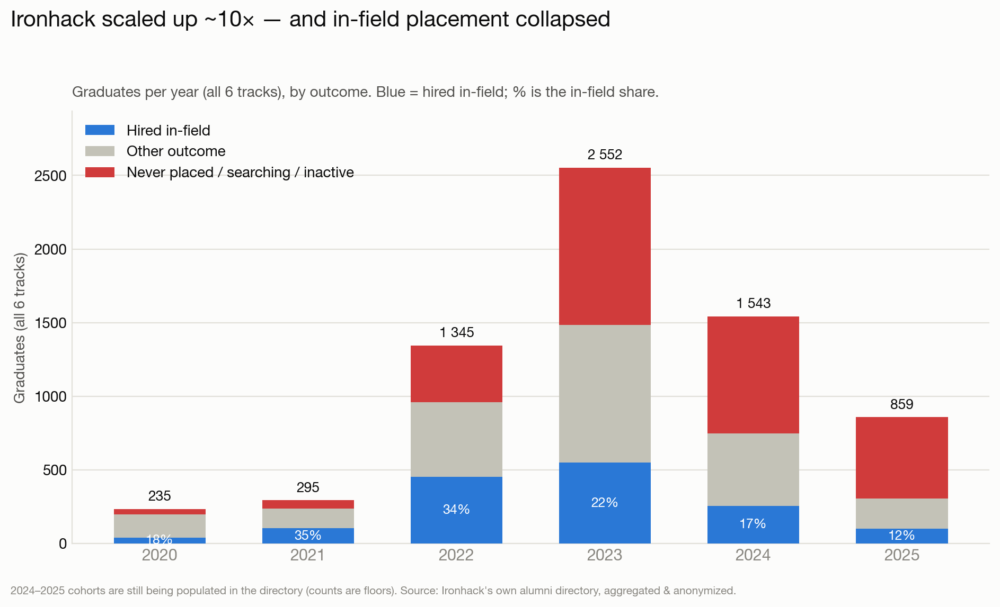
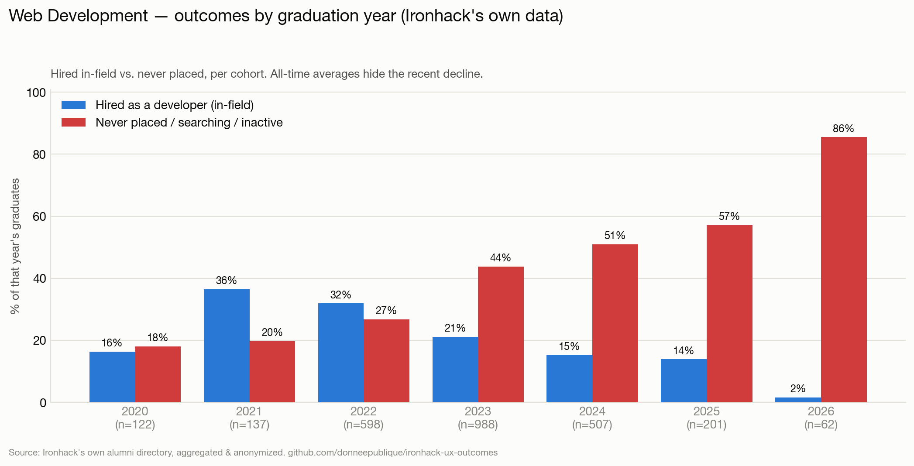
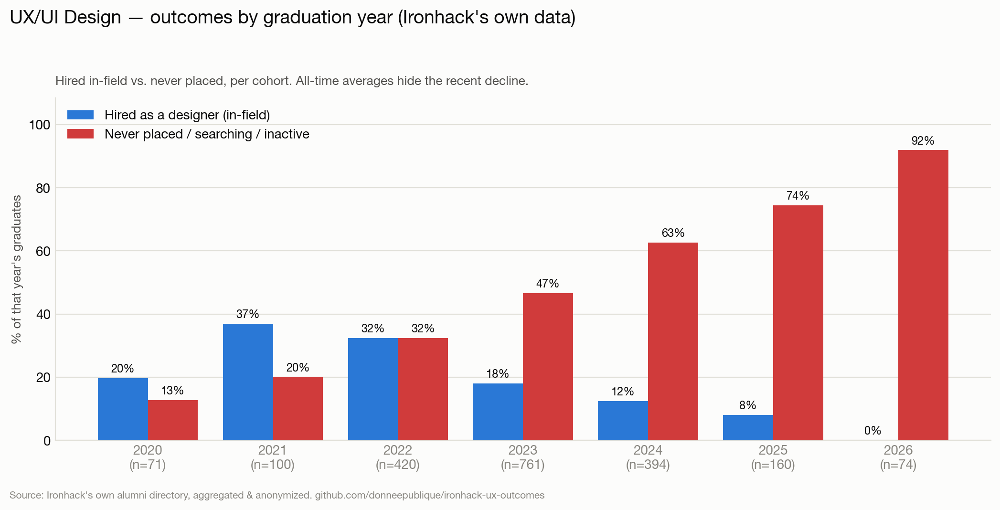
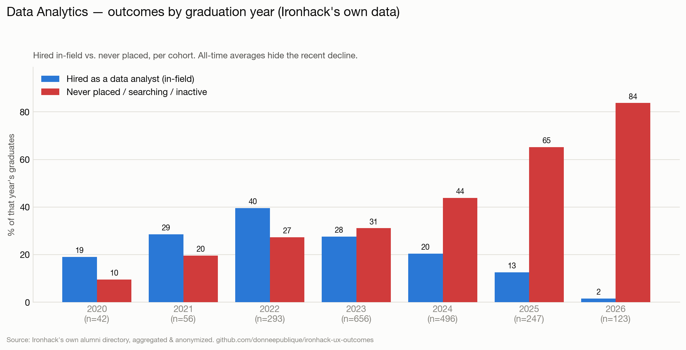
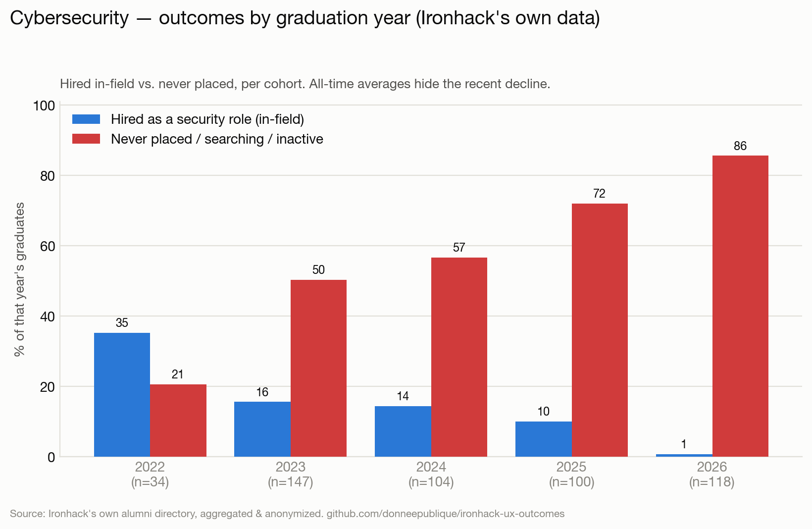
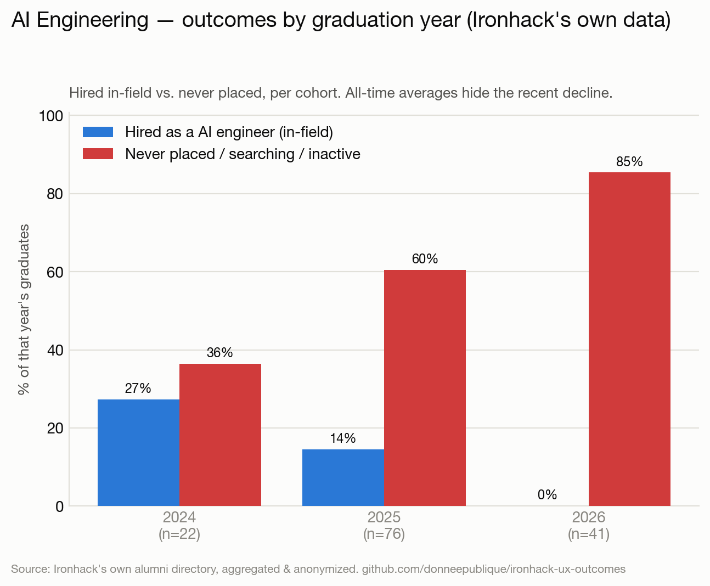
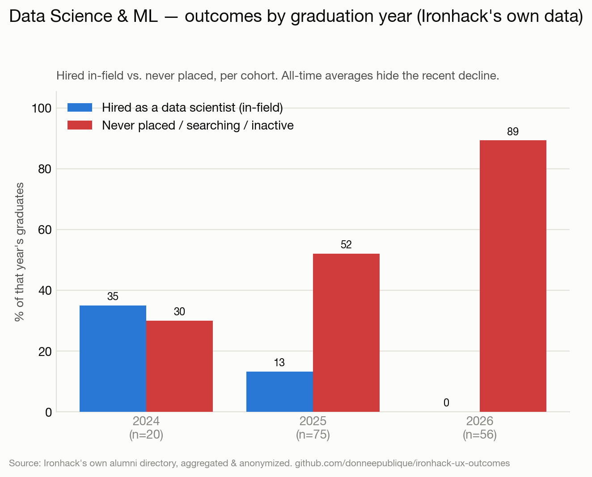

# Ironhack-Bootcamp-Ergebnisse: ~10× mehr Absolventen, Vermittlung eingebrochen — aus ihren eigenen Daten

[English](README.md) · [Français](README.fr.md) · 🌍 **Deutsch** · [Português](README.pt.md)

**Was nach einem Ironhack-Bootcamp wirklich passiert — über alle 6 Tracks, Kohorte für Kohorte — aus Ironhacks eigenem internen Alumni-Verzeichnis.**

> Ein Datenjournalismus-Projekt auf Ironhacks **eigenem Datenbestand**: dem Alumni-Verzeichnis (`my.ironhack.com`), in dem Ironhack selbst das Vermittlungsergebnis jedes Absolventen erfasst (Zugang über ein Alumni-Konto). Als interner Datensatz, nicht als Marketingseite, enthält es auch die Misserfolge. Alles ist **aggregiert und anonym** — niemand namentlich, keine personenbezogenen Rohdaten erneut veröffentlicht. Es ist **keine** Betrugsbehauptung. Die Geschichte ist keine einzelne Zahl, sondern ein **Trend**: Als Ironhack auf die größten Kohorten seiner Geschichte skalierte und neue Premium-Tracks startete, brach der Anteil der tatsächlich *im Fachgebiet* Eingestellten ein.

## Inhalt

- [Gesamtbild](#gesamtbild) — alle 6 Tracks: Skalierung und Einbruch
- **Pro Bootcamp:**
  - [Webentwicklung](#webentwicklung)
  - [UX/UI Design](#uxui-design)
  - [Data Analytics](#data-analytics)
  - [Cybersecurity](#cybersecurity)
  - [AI Engineering](#ai-engineering)
  - [Data Science & ML](#data-science--ml)
- [Die 90-Prozent-Zahl](#die-90-prozent-zahl)
- [Methode](#methode) · [Grenzen](#grenzen) · [Herkunft](#herkunft--manipulationssicherheit) · [Ethik](#ethik--datenschutz)

---

## Gesamtbild

Ironhack wuchs von einigen Hundert Absolventen pro Jahr auf **Tausende** — und im selben Zeitraum fiel der tatsächlich *im Fachgebiet* eingestellte Anteil von ~35 % auf ~11 %.

| Abschlussjahr | Absolventen (6 Tracks) | Im Fachgebiet eingestellt | Nie vermittelt / auf Suche |
|---|---:|---:|---:|
| 2020 | 235 | 17 % | 14 % |
| 2021 | 295 | **35 %** | 19 % |
| 2022 | 1.345 | 33 % | 28 % |
| 2023 | 2.552 | 21 % | 41 % |
| 2024 | 1.543 | 16 % | 51 % |
| 2025 | 859 | **11 %** | 64 % |

Zwei Dinge geschahen gleichzeitig, und ihr Zusammenspiel ist die Geschichte:

- **Skalierung.** Die jährlichen Kohorten wuchsen zwischen 2020 und dem Höhepunkt 2022‑2023 um das **~10‑fache** — die größten in Ironhacks Geschichte.
- **Einbruch.** Die Fachvermittlung fiel nach dem 2021er-Boom jedes Jahr — von 35 % auf ~11 %.

Die größten je eingeschriebenen Kohorten haben also die schlechtesten Ergebnisse. In absoluten Zahlen hat **allein der Jahrgang 2023 1.066 Absolventen als „nie vermittelt"** erfasst, gegenüber 35 im Jahr 2020. *(Die Zahlen 2024‑2025 sind Untergrenzen — das Verzeichnis wird für neuere Jahre noch befüllt — daher ist die fallende Vermittlungs‑**quote**, nicht der Kopfzahl, das verlässliche Signal.)*

Über **≈7.700 Absolventen in allen 6 Tracks** gilt dieses Muster überall. Pro Track:

## Webentwicklung

**2.832 Absolventen.** Als Entwickler im Fachgebiet eingestellt: 2021 **36 %** → 2022 32 % → 2023 21 % → 2024 15 % → **2025 14 %**, mit **44–57 %** der letzten zwei Kohorten nie vermittelt.

## UX/UI Design

**2.126 Absolventen.** Als Designer eingestellt: 2021 **37 %** → 2023 18 % → 2024 12 % → **2025 8 %**, mit **63–74 %** der jüngsten Kohorten nie vermittelt. Auch der Track mit der detailliertesten Aufschlüsselung pro Standort — Remote (größte Kohorte) ist der schwächste.

## Data Analytics

**1.954 Absolventen.** Ironhacks *stärkster* Track — und bricht trotzdem ein: 2022 **40 %** → 2023 28 % → 2024 20 % → **2025 13 %** (65 % nie vermittelt).

## Cybersecurity

**505 Absolventen.** 2022 35 % → 2023 16 % → 2024 14 % → **2025 10 %** im Fachgebiet, mit **57–72 %** der jüngsten Kohorten nie vermittelt.

## AI Engineering

**139 Absolventen** (neuester, teuerster Track). **Jahrgang 2025: 14 % im Fachgebiet eingestellt, 60 % nie vermittelt** (n=76). Gestartet genau, als der Markt kippte.

## Data Science & ML

**151 Absolventen.** **Jahrgang 2025: 13 % im Fachgebiet, 52 % nie vermittelt** (n=75) — die niedrigste Fachquote aller Tracks.

---

## Die 90-Prozent-Zahl

Ironhacks „von PwC geprüfter" Outcomes-Bericht warb mit *„we placed 90% of job‑seeking graduates within 6 months"* (76 % / 89 % nach 90 / 180 Tagen). Diese Zahl stützt sich auf zwei Kniffe: einen **engen Nenner** (nur „suchende" Absolventen) und einen **weiten Zähler** („vermittelt" = *irgendein* Job, auch fachfremd oder Rückkehr zum früheren Arbeitgeber). Großzügig auf die Gesamtdaten angewandt, erreicht man ~**51 %**, nicht 90 %; zählt man nur *als Designer eingestellt ÷ alle Absolventen*, sind es **18 %** (UX/UI, gesamt) — und für neuere Kohorten weit weniger. Diese Zahl ist nicht der Kern des Berichts; **Trend und Skalierung** sind es. (Die Claim-Seite leitet heute auf den Blog um; archiviert: [Wayback, 2022](http://web.archive.org/web/20220126230803/https://www.ironhack.com/en/news/ironhack-student-outcomes-report-audited-by-pwc).)

## Methode

- **Quelle:** `POST my.ironhack.com/api/alumni` — Ironhacks internes Alumni-Verzeichnis (Zugang über Alumni-Konto), sein Datenbestand des `career_services.status` jedes Absolventen. Keine öffentliche Seite, spiegelt also die echte Ergebnisverteilung inkl. Misserfolge.
- **Umfang:** alle 6 Tracks (ux, wd, da, cy, ai, ml), alle Standorte — **≈7.700 Absolventen**.
- **Grundwahrheit:** Ironhacks eigene Labels, in klare Kategorien gruppiert. „Im Fachgebiet" = `hired_in_field`; „nie vermittelt / auf Suche" bündelt `placement_not_successful`, `searching`, `inactive`, `intervention_*`, `deferred_*`, `pending`. Vollständige Zuordnung unten.
- **Nach Jahr:** Kohorten werden nach Abschlussjahr getrennt, damit neuere Klassen nicht in Boom-Durchschnitten verschwinden.
- **Datenschutz:** nur Zählungen veröffentlicht.

Vollständige Zuordnung Status → Kategorie

| Kategorie | Rohe `career_services.status`-Werte |
|---|---|
| Im Fachgebiet eingestellt | `hired_in_field` |
| Beschäftigt, fachfremd | `hired_out_of_field`, `back_to_job`, `ironhack_employee` |
| Freiberuflich / selbstständig | `freelance`, `entrepreneur` |
| Nur Praktikum | `internship`, `short_term` |
| Nie vermittelt / auf Suche / inaktiv | `placement_not_successful`, `searching`, `inactive`, `intervention_careers`, `intervention_careers_not_success`, `intervention_education`, `intervention_education_not_success`, `deferred_more_than_45d`, `deferred_more_than_45d_sc`, `deferred_less_than_45d`, `pending` |
| Fachgebiet verlassen | `back_to_university`, `personal_development`, `withdrew` |
| Nicht abgeschlossen / nicht berechtigt | `not_graduated_cs`, `not_eligible` |

## Grenzen

- **Ironhacks Labels**, wörtlich genommen; genaue interne Definition von `placement_not_successful` unbekannt, ebenso die Aktualisierungsfrequenz von `searching`/`inactive`.
- **Momentaufnahme** (Juli 2026); neuere Kohorten (2024‑2026) werden noch befüllt, ihre **Kopfzahlen sind Untergrenzen** — verlässlich ist die fallende **Quote**, und die reifen Kohorten (2021‑2023, 1,5–5 Jahre her) zeigen den Einbruch bereits.
- Einige Datensätze tragen ein Platzhalterdatum (`1987`, Madrid) — aus den Jahresdiagrammen ausgeschlossen, in den Summen behalten.

## Herkunft & Manipulationssicherheit

Die Erfassung wird zu einer Merkle-Wurzel gehasht und **von einer unabhängigen RFC-3161-Stelle zeitgestempelt** — sie kann nicht stillschweigend umgeschrieben werden und überlebt eine spätere Löschung durch Ironhack. Die Rohdaten können **legitimen Förder- oder Aufsichtsstellen auf Anfrage** zur Prüfung bereitgestellt werden. Bedrohungsmodell + Verifikation: [PROVENANCE.md](PROVENANCE.md).

## Ethik & Datenschutz

- Quelle ist Ironhacks **internes Alumni-Verzeichnis**, mit Alumni-Konto aufgerufen — ihr Datenbestand, keine öffentliche Seite.
- **Nichts Identifizierendes wird erneut veröffentlicht** — nur aggregierte, anonyme Zählungen. Personenbezogene Rohdaten (Namen, LinkedIn, Fotos) sind git-ignoriert und verlassen nie den Rechner des Analysten.
- Ironhacks **eigene Labels**, wörtlich — ein Vergleich zwischen Marketing und dokumentierten Ergebnissen, keine Betrugsbehauptung.

## Lizenz

Die zugrunde liegenden Daten gehören Ironhack; Analyse, Code und Diagramme stehen unter der MIT-Lizenz.
