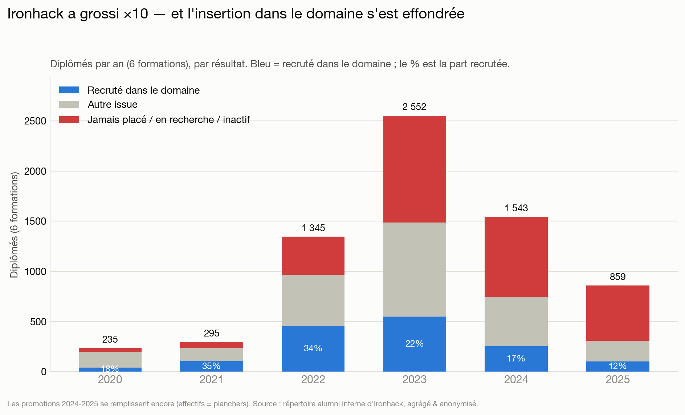
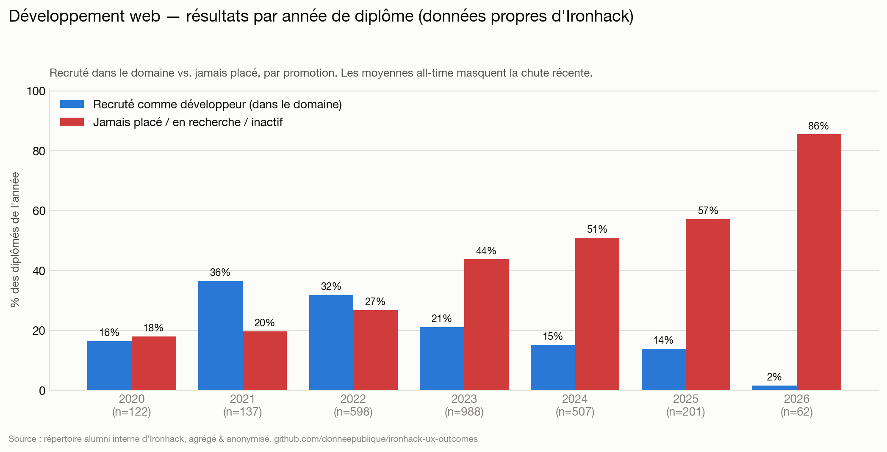
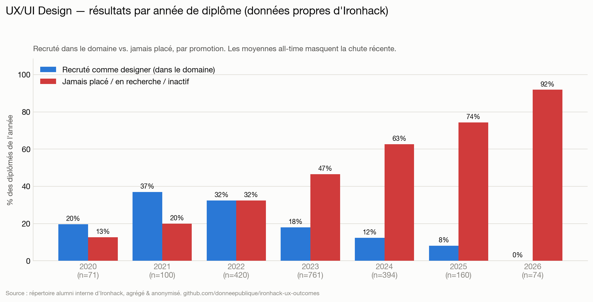
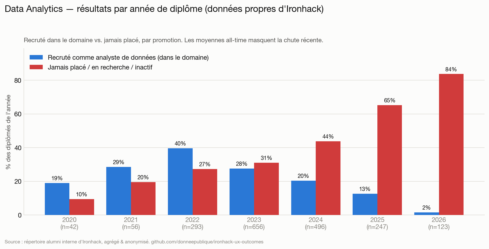
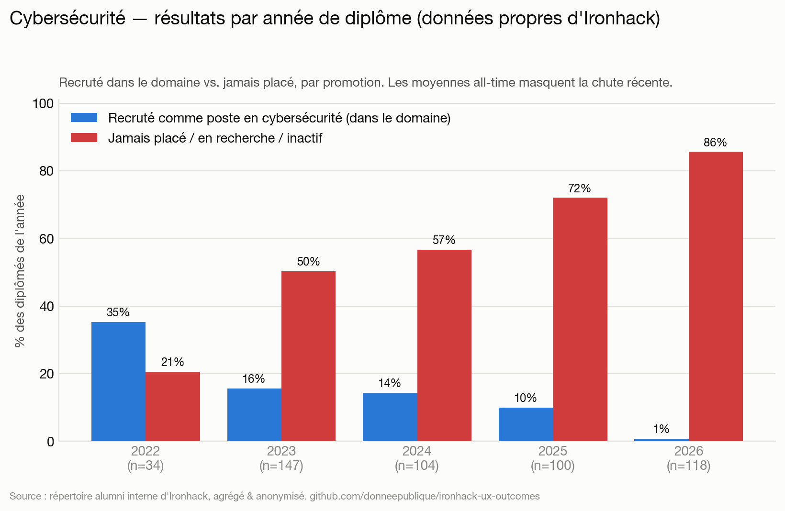
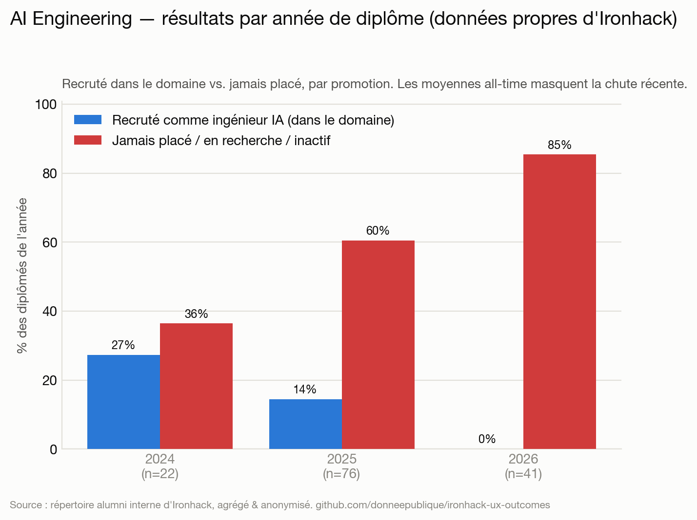
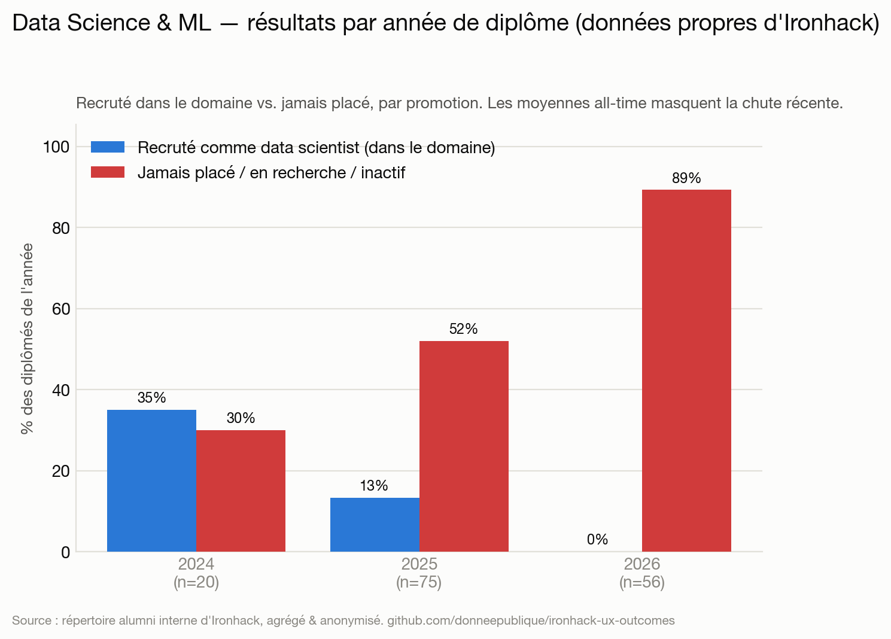

# Résultats des bootcamps Ironhack : ×10 d'élèves, insertion effondrée — d'après leurs propres données

[English](README.md) · 🌍 **Français** · [Deutsch](README.de.md) · [Português](README.pt.md)

**Ce qui arrive réellement après un bootcamp Ironhack — sur les 6 formations, promotion par promotion — d'après le répertoire alumni interne d'Ironhack.**

> Exercice de journalisme de données sur le **système d'enregistrement d'Ironhack** : le répertoire alumni (`my.ironhack.com`) où Ironhack consigne elle‑même le résultat d'insertion de chaque diplômé (accès via un compte alumni). Étant l'enregistrement interne et non une page marketing, il inclut aussi les échecs. Tout est **agrégé et anonyme** — aucun individu nommé, aucune donnée personnelle brute republiée. Ce n'est **pas** une accusation de fraude. L'histoire n'est pas un chiffre unique, c'est une **tendance** : au moment où Ironhack a atteint ses plus grosses promotions et lancé de nouvelles formations premium, la part des diplômés réellement recrutés *dans le domaine* s'est effondrée.

## Sommaire

- [Vue globale](#vue-globale) — les 6 formations : montée en charge et chute
- **Par bootcamp :**
  - [Développement web](#développement-web)
  - [UX/UI Design](#uxui-design)
  - [Data Analytics](#data-analytics)
  - [Cybersécurité](#cybersécurité)
  - [AI Engineering](#ai-engineering)
  - [Data Science & ML](#data-science--ml)
- [Où se situe le « ~90 % placés »](#où-se-situe-le--90--placés)
- [Méthode](#méthode) · [Limites](#limites) · [Provenance](#provenance--preuve-dintégrité) · [Éthique](#éthique--confidentialité)

---

## Vue globale

Ironhack est passé de quelques centaines de diplômés par an à des **milliers** — et sur la même période, la part réellement recrutée *dans le domaine* est tombée de ~35 % à ~11 %.

| Année de diplôme | Diplômés (6 formations) | Recrutés dans le domaine | Jamais placés / en recherche |
|---|---:|---:|---:|
| 2020 | 235 | 17 % | 14 % |
| 2021 | 295 | **35 %** | 19 % |
| 2022 | 1 345 | 33 % | 28 % |
| 2023 | 2 552 | 21 % | 41 % |
| 2024 | 1 543 | 16 % | 51 % |
| 2025 | 859 | **11 %** | 64 % |

Deux phénomènes simultanés, et c'est leur conjonction qui fait l'histoire :

- **L'échelle.** Les promotions annuelles ont été multipliées par **~10** entre 2020 et le pic 2022‑2023 — les plus grosses de l'histoire d'Ironhack.
- **L'effondrement.** L'insertion dans le domaine chute chaque année après le boom 2021 — de 35 % à ~11 %.

Les plus grosses promotions jamais recrutées sont donc celles aux pires résultats. En absolu, **la seule promotion 2023 compte 1 066 diplômés « jamais placés »**, contre 35 en 2020. *(Les effectifs 2024‑2025 sont des planchers — le répertoire se remplit encore pour les années récentes — c'est donc le taux d'insertion qui baisse, pas le décompte, qui est le signal fiable.)*

Sur **≈7 700 diplômés des 6 formations**, le schéma se répète partout. Par formation :

## Développement web

**2 832 diplômés.** Recrutés comme développeur dans le domaine : 2021 **36 %** → 2022 32 % → 2023 21 % → 2024 15 % → **2025 14 %**, avec **44–57 %** des deux dernières promotions jamais placées.

## UX/UI Design

**2 126 diplômés.** Recrutés comme designer : 2021 **37 %** → 2023 18 % → 2024 12 % → **2025 8 %**, avec **63–74 %** des promotions récentes jamais placées. C'est aussi la formation au détail le plus fin par campus — le campus à distance (le plus gros) est le plus faible.

## Data Analytics

**1 954 diplômés.** La formation la *plus solide* d'Ironhack — et elle s'effondre quand même : 2022 **40 %** → 2023 28 % → 2024 20 % → **2025 13 %** (65 % jamais placés).

## Cybersécurité

**505 diplômés.** 2022 35 % → 2023 16 % → 2024 14 % → **2025 10 %** recrutés dans le domaine, avec **57–72 %** des promotions récentes jamais placées.

## AI Engineering

**139 diplômés** (formation la plus récente et la plus chère). **Promotion 2025 : 14 % recrutés dans le domaine, 60 % jamais placés** (n=76). Lancée pile quand le marché s'est retourné.

## Data Science & ML

**151 diplômés.** **Promotion 2025 : 13 % recrutés dans le domaine, 52 % jamais placés** (n=75) — le plus faible taux d'insertion de toutes les formations.

---

## Où se situe le « ~90 % placés »

Vers **2019**, le *premier* rapport d'insertion d'Ironhack (présenté comme audité par PwC) annonçait *« we placed 90% of job‑seeking graduates within 6 months »* (76 % / 89 % à 90 / 180 jours). Ce chiffre reposait sur deux artifices : un **dénominateur restreint** (uniquement les « chercheurs d'emploi ») et un **numérateur large** (« placé » = *n'importe quel* emploi, y compris hors domaine ou retour chez un ancien employeur). Reconstitué généreusement sur l'ensemble des données, on atteint ~**51 %**, pas 90 % ; en ne comptant que *recrutés comme designer ÷ tous les diplômés*, c'est **18 %** (UX/UI, all‑time) — et bien moins pour les promotions récentes. Ce chiffre, **vieux d'environ six ans et antérieur au retournement du marché**, n'est **plus affiché** aujourd'hui (page redirigée ; copie archivée de 2022 sur la [Wayback Machine](http://web.archive.org/web/20220126230803/https://www.ironhack.com/en/news/ironhack-student-outcomes-report-audited-by-pwc)) ; la communication actuelle est plus prudente (« pay once you get a job », « land your first role »). Ce n'est pas le cœur du rapport ; la **tendance et l'échelle** le sont.

## Méthode

- **Source :** `POST my.ironhack.com/api/alumni` — le répertoire alumni interne d'Ironhack (accès via compte alumni), son système d'enregistrement du `career_services.status` de chaque diplômé. Pas une page publique, donc il reflète la vraie distribution des résultats, échecs compris.
- **Périmètre :** les 6 formations (ux, wd, da, cy, ai, ml), tous campus — **≈7 700 diplômés**.
- **Vérité terrain :** les étiquettes propres d'Ironhack, regroupées en catégories claires. « Recruté dans le domaine » = `hired_in_field` ; « jamais placé / en recherche » regroupe `placement_not_successful`, `searching`, `inactive`, `intervention_*`, `deferred_*`, `pending`. Correspondance complète ci‑dessous.
- **Par année :** les promotions sont découpées par année de diplôme pour ne pas noyer les classes récentes dans les moyennes de l'ère du boom.
- **Confidentialité :** seuls des décomptes sont publiés.

Correspondance complète statut → catégorie

| Catégorie | Valeurs brutes `career_services.status` |
|---|---|
| Recruté dans le domaine | `hired_in_field` |
| En emploi, hors domaine | `hired_out_of_field`, `back_to_job`, `ironhack_employee` |
| Freelance / à son compte | `freelance`, `entrepreneur` |
| Stage uniquement | `internship`, `short_term` |
| Jamais placé / en recherche / inactif | `placement_not_successful`, `searching`, `inactive`, `intervention_careers`, `intervention_careers_not_success`, `intervention_education`, `intervention_education_not_success`, `deferred_more_than_45d`, `deferred_more_than_45d_sc`, `deferred_less_than_45d`, `pending` |
| A quitté le domaine | `back_to_university`, `personal_development`, `withdrew` |
| Non diplômé / non éligible | `not_graduated_cs`, `not_eligible` |

## Limites

- **Étiquettes d'Ironhack**, prises au pied de la lettre ; définition interne exacte de `placement_not_successful` inconnue, de même que la fréquence de mise à jour de `searching`/`inactive`.
- **Instantané** (juillet 2026) ; les promotions récentes (2024‑2026) se remplissent encore, leurs **effectifs sont des planchers** — le signal fiable est le **taux** d'insertion en baisse, et les cohortes matures (2021‑2023, 1,5 à 5 ans de recul) montrent déjà l'effondrement.
- Quelques fiches portent une date placeholder (`1987`, Madrid) — exclues des graphes par année, conservées dans les totaux.

## Provenance & preuve d'intégrité

La capture est hachée en une racine de Merkle et **horodatée par une autorité RFC 3161 indépendante** : elle ne peut être réécrite discrètement et survit à une suppression ultérieure par Ironhack. Les données brutes peuvent être fournies **sur demande aux organismes de financement ou de contrôle légitimes** pour vérification. Modèle de menace + vérification : [PROVENANCE.md](PROVENANCE.md).

## Éthique & confidentialité

- Source : le **répertoire alumni interne** d'Ironhack, consulté via un compte alumni — leur système d'enregistrement, pas une page publique.
- **Rien d'identifiant n'est republié** — uniquement des décomptes agrégés et anonymes. Les données brutes par personne (noms, LinkedIn, photos) sont git‑ignorées et ne quittent jamais la machine de l'analyste.
- Les **étiquettes d'Ironhack**, au pied de la lettre — une comparaison entre marketing et résultats constatés, pas une accusation de fraude.

## Licence

Les données sous‑jacentes appartiennent à Ironhack ; l'analyse, le code et les graphiques sont publiés sous licence MIT.
