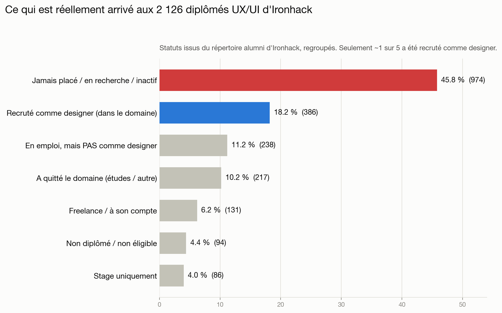
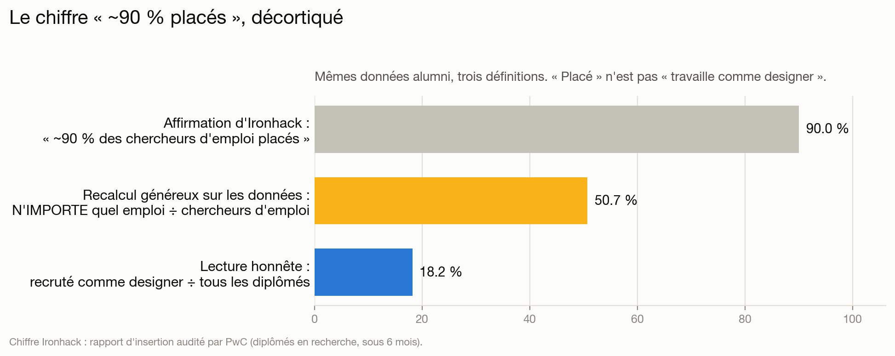
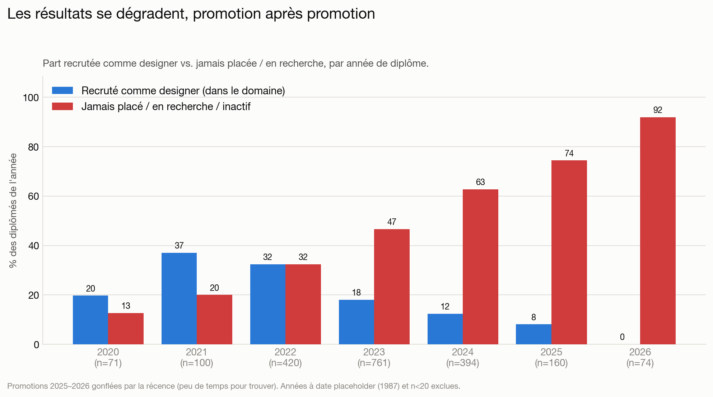
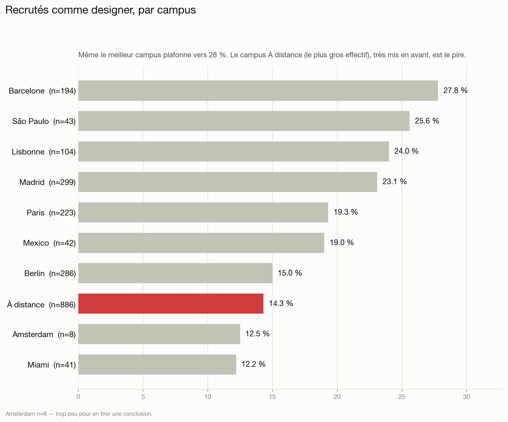
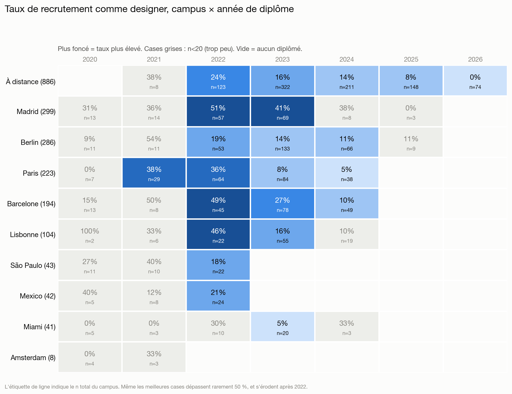

# Un bootcamp UX/UI Ironhack fait-il de vous un·e « UX designer bien payé·e » ?

[English](README.md) · 🌍 **Français** · [Deutsch](README.de.md) · [Português](README.pt.md)

**Une lecture chiffrée des résultats qu'Ironhack publie lui-même.**

Ironhack vend son bootcamp UX/UI sur l'insertion : *« ~90 % des diplômés en recherche placés en 6 mois »* (audité par PwC), *« 96 % de taux de diplomation »*, un discours salarial construit autour d'une carrière UX/UI. Ce dépôt confronte cette promesse au **répertoire alumni interne d'Ironhack** — le répertoire de networking/recrutement que voient les anciens élèves connectés sur `my.ironhack.com`, couvrant tous les diplômés UX/UI des 10 campus — et le tableau est très différent.

> **Exercice de journalisme de données fondé sur le propre système d'enregistrement d'Ironhack.** La source n'est pas une page marketing triée mais le **répertoire alumni interne** d'Ironhack, où le statut d'insertion de chaque diplômé est consigné (accès via un compte alumni). Précisément parce que c'est l'enregistrement interne et non une vitrine, il contient **l'éventail complet des résultats, échecs compris** — il n'est pas trié. Tous les résultats ici sont **agrégés et anonymes** : aucun individu n'est nommé, aucune donnée personnelle brute n'est republiée. Ce n'est **pas** une accusation de fraude : c'est l'écart entre une *impression marketing* (« devenir designer ») et le *résultat typiquement constaté*, en prenant les propres étiquettes d'Ironhack au pied de la lettre.

---

## En bref

| Indicateur (10 campus, n = 2 126 diplômés UX/UI) | Valeur |
|---|---:|
| **Recruté·e comme designer salarié·e (dans le domaine)** | **18,2 %** (386) |
| Jamais placé·e / encore en recherche / inactif·ve | **45,8 %** (974) |
| Taux « placé » affiché par Ironhack | ~90 % |
| Même calcul « n'importe quel emploi ÷ chercheurs d'emploi » refait sur ces données | **50,7 %** |
| Cohortes matures uniquement (diplômées depuis ≥ 12 mois), recrutées dans le domaine | 19,2 % |
| Promotion 2023 (n=761, temps largement suffisant), recrutée dans le domaine | 18,0 % |

**Moins d'1 diplômé sur 5 est devenu designer en exercice.** Les « ~90 % placés » ne tiennent que sous une définition étroite de *qui compte* (uniquement les chercheurs d'emploi) et une définition large de ce que « placé » signifie (n'importe quel emploi — y compris hors design ou un retour chez un ancien employeur). Et les résultats **se dégradent à chaque promotion**.

---

## Ce qu'Ironhack promet

- **« Nous avons placé 90 % des diplômés en recherche en 6 mois »** — rapport d'insertion audité par PwC.
- **76 % placés sous 90 jours, 89 % sous 180 jours**, sur une cohorte déclarée de 829 diplômés (dont 322 en UX/UI).
- **96 % de taux de diplomation.**
- Un discours salarial autour de l'UX/UI (le propre blog salaire d'Ironhack cite par ex. **25–35 k€ en Espagne**, **42 k€ en Allemagne** ; des supports d'insertion US ont cité ~**65 000 $** de départ).

Deux mots portent l'affirmation : **« en recherche »** (le dénominateur) et **« placé »** (jamais défini comme *dans le domaine*). Le répertoire alumni révèle ce que ces mots masquent.

## Méthode

- **Source :** `POST my.ironhack.com/api/alumni` — le répertoire alumni interne d'Ironhack, l'enregistrement que consultent les anciens connectés (accès ici via un compte alumni). Chaque fiche porte l'étiquette `career_services.status` propre à Ironhack. C'est le système d'enregistrement d'Ironhack, pas une page publique, donc il reflète la vraie distribution des résultats, échecs compris.
- **Périmètre :** tous les diplômés UX/UI (`track=ux`) que le répertoire expose, sur les **10 campus** — **n = 2 126**.
- **Vérité terrain :** on prend les étiquettes d'Ironhack au pied de la lettre, regroupées en catégories en langage clair. On n'invente rien. La correspondance étiquette brute → catégorie figure en [annexe](#annexe-a--énumération-complète-des-statuts-24-étiquettes).
- **Contrôle de récence :** les diplômés des ~12 derniers mois sont naturellement encore « en recherche » ; on rapporte donc à part les **cohortes matures** (≥ 12 mois, n = 1 999) et une répartition **année par année**.
- **Confidentialité :** tous les livrables publiés sont des décomptes. Noms, photos et URL LinkedIn sont restés sur la machine de l'analyste et sont exclus du dépôt (git-ignore).

---

## 1. Ce qui est réellement arrivé

En regroupant les propres étiquettes d'Ironhack pour les 2 126 diplômés UX/UI :

| Résultat (étiquettes d'Ironhack, regroupées) | Nombre | Part |
|---|---:|---:|
| Jamais placé / encore en recherche / inactif | 974 | **45,8 %** |
| **Recruté comme designer salarié (dans le domaine)** | **386** | **18,2 %** |
| En emploi, mais **pas** comme designer | 238 | 11,2 % |
| A quitté le domaine (reprise d'études / autre) | 217 | 10,2 % |
| Freelance / à son compte | 131 | 6,2 % |
| Non diplômé / non éligible | 94 | 4,4 % |
| Stage uniquement | 86 | 4,0 % |

L'étiquette brute la plus fréquente est `placement_not_successful` — **584 personnes, 27,5 % de l'ensemble.** Plus de diplômés sont **retournés à un emploi antérieur (hors design)** (138) ou **repartis à l'université** (120) que ne le laisserait penser le marketing. Vingt-quatre ont fini par **travailler chez Ironhack** (`ironhack_employee`).

## 2. Comment le chiffre « ~90 % placés » est fabriqué

On peut reconstituer le cadrage généreux d'Ironhack à partir des mêmes données :

1. **Réduire le dénominateur.** Retirer tous ceux qui ne sont pas « en recherche » — inactifs, retour aux études, non diplômés, développement personnel, désistements. Cela ôte ~470 personnes (2 126 → 1 660).
2. **Élargir le numérateur.** Compter **n'importe quel** emploi comme un « placement » — dans le domaine, hors domaine, freelance, entrepreneur, stage ou retour chez un ancien employeur (841 personnes).

Même en faisant **les deux**, le mieux qu'on atteigne est :

| Indicateur | Résultat |
|---|---:|
| « Placé » façon Ironhack (n'importe quel emploi ÷ chercheurs d'emploi), toutes cohortes | **50,7 %** |
| Idem, cohortes matures seulement | 53,7 % |
| **Lecture honnête : recruté comme designer ÷ tous les diplômés** | **18,2 %** |

Donc même en poussant les définitions au maximum, cette population tourne autour de **50 %, pas 90 %.** L'écart restant est ce que « audité par PwC » absorbe discrètement : une cohorte de reporting spécifique, bornée dans le temps et auto-déclarée — pas l'ensemble des alumni qu'Ironhack suit et affiche. Le point crucial pour un·e futur·e étudiant·e : **« placement » ≠ « travaille comme designer ».**

## 3. Résultats par année de diplôme — l'effondrement

C'est ce que le chiffre unique masque. En découpant par année, le taux de recrutement dans le domaine **chute d'une promotion à l'autre** tandis que « jamais placé » **explose** :

Cohortes les plus récentes en premier :

| Année | n | Dans le domaine | Pas comme designer | Freelance | Jamais placé | Quitté le domaine | Non diplômé | Stage |
|---|---:|---:|---:|---:|---:|---:|---:|---:|
| 2026 | 74 | 0,0 % | 4,1 % | 1,4 % | 91,9 % | 1,4 % | 0,0 % | 1,4 % |
| 2025 | 160 | 8,1 % | 7,5 % | 3,1 % | 74,4 % | 3,1 % | 1,2 % | 2,5 % |
| 2024 | 394 | 12,4 % | 8,1 % | 2,5 % | 62,7 % | 3,8 % | 5,6 % | 4,8 % |
| 2023 | 761 | 18,0 % | 11,4 % | 7,9 % | 46,6 % | 6,2 % | 5,8 % | 4,1 % |
| 2022 | 420 | 32,4 % | 9,5 % | 7,9 % | 32,4 % | 7,4 % | 4,5 % | 6,0 % |
| 2021 | 100 | **37,0 %** | 12,0 % | 10,0 % | 20,0 % | 14,0 % | 1,0 % | 6,0 % |
| 2020 | 71 | 19,7 % | 22,5 % | 8,5 % | 12,7 % | 32,4 % | 4,2 % | 0,0 % |
| *2019* | *13* | *0,0 %* | *23,1 %* | *7,7 %* | *15,4 %* | *53,8 %* | *0,0 %* | *0,0 %* |

Deux phénomènes se superposent, et les deux comptent :

- La **récence** gonfle « jamais placé » pour **2025–2026** (ces diplômés ont eu peu de temps pour trouver) — donc ne surinterprétez pas les deux dernières lignes.
- Mais le **déclin est réel et antérieur à la récence.** La promotion **2023 (n=761)** est diplômée depuis 1,5 à 3 ans — largement le temps — et n'affiche que **18 %** dans le domaine, avec **47 % jamais placés.** Le pic **2022** (32 %) avait déjà été divisé par deux en 2023. Cela suit la contraction bien documentée du marché du design junior à partir de 2023 : un certificat de bootcamp qui « marchait » peut-être en 2021 a cessé de marcher.

*(Tableau du plus récent au plus ancien. `2019` (n=13, en italique) est affiché mais trop peu nombreux pour peser ; les 133 fiches datées `1987` sont un artefact de date manquante, pas une vraie promotion — les deux sont exclues du graphique. Voir [qualité des données](#notes-sur-la-qualité-des-données).)*

## 4. Résultats par campus

Le taux de recrutement dans le domaine varie fortement selon le campus — et le programme **À distance**, aussi le **plus gros** (886 diplômés, 42 % du jeu de données), est parmi les **pires** :

| Campus | n | Dans le domaine | Jamais placé / en recherche |
|---|---:|---:|---:|
| Barcelone | 194 | **27,8 %** | 36,1 % |
| São Paulo | 43 | 25,6 % | 34,9 % |
| Lisbonne | 104 | 24,0 % | 22,1 % |
| Madrid | 299 | 23,1 % | 20,7 % |
| Paris | 223 | 19,3 % | 42,6 % |
| Mexico | 42 | 19,0 % | 26,2 % |
| Berlin | 286 | 15,0 % | 55,6 % |
| **À distance** | **886** | **14,3 %** | **59,1 %** |
| Amsterdam | 8 | 12,5 % | 0,0 % |
| Miami | 41 | 12,2 % | 36,6 % |

Même le **meilleur** campus (Barcelone) plafonne vers 28 % dans le domaine. *(Amsterdam n=8 est trop faible pour en tirer une conclusion.)*

## 5. Le détail : campus × année de diplôme

Croiser les deux dimensions montre précisément **où et quand** le bootcamp a fonctionné. Les cases à effectif fiable (n ≥ 20) sont colorées par le taux ; les cases à faible effectif (n < 20, grises dans le graphe / *en italique* dans le tableau) sont trop bruitées.

**Taux de recrutement dans le domaine — % (n) par case** *(italique = n < 20, petit échantillon ; — = aucun diplômé cette année-là)* :

| Campus (n total) | 2020 | 2021 | 2022 | 2023 | 2024 | 2025 | 2026 |
|---|---:|---:|---:|---:|---:|---:|---:|
| **À distance** (886) | — | *38 % (8)* | 24 % (123) | 16 % (322) | 14 % (211) | 8 % (148) | 0 % (74) |
| **Madrid** (299) | *31 % (13)* | *36 % (14)* | 51 % (57) | 41 % (69) | *38 % (8)* | *0 % (3)* | — |
| **Berlin** (286) | *9 % (11)* | *54 % (11)* | 19 % (53) | 14 % (133) | 11 % (66) | *11 % (9)* | — |
| **Paris** (223) | *0 % (7)* | 38 % (29) | 36 % (64) | 8 % (84) | 5 % (38) | — | — |
| **Barcelone** (194) | *15 % (13)* | *50 % (8)* | 49 % (45) | 27 % (78) | 10 % (49) | — | — |
| **Lisbonne** (104) | *100 % (2)* | *33 % (6)* | 46 % (22) | 16 % (55) | *10 % (19)* | — | — |
| **São Paulo** (43) | *27 % (11)* | *40 % (10)* | 18 % (22) | — | — | — | — |
| **Mexico** (42) | *40 % (5)* | *12 % (8)* | 21 % (24) | — | — | — | — |
| **Miami** (41) | *0 % (5)* | *0 % (3)* | *30 % (10)* | 5 % (20) | *33 % (3)* | — | — |
| **Amsterdam** (8) | *0 % (4)* | *33 % (3)* | — | — | — | — | — |

Même les meilleures cases bien échantillonnées — **Madrid 2022 (51 %, n=57)**, **Barcelone 2022 (49 %, n=45)**, **Madrid 2023 (41 %, n=69)** — atteignent à peine un pile ou face, et seulement au pic de 2022. Dès 2023–2024, chaque campus bien échantillonné retombe dans les dizaines basses.

## 6. La question du « freelance »

On soupçonne souvent que « UX designer freelance » est une façon polie de dire *n'a pas trouvé de poste salarié.* Ici, le freelance est un **petit** groupe — **89 personnes, 4,2 %** (131, 6,2 % en incluant `entrepreneur`) — ce n'est donc **pas** l'essentiel. Mais il est étonnamment **ancien** : le freelance médian est diplômé depuis **40 mois**, et **88 sur 89** sont freelance depuis **24 mois ou plus.** Cela est cohérent avec (sans le prouver) un freelancing qui est une destination durable plutôt qu'un pont provisoire vers l'emploi.

## 7. Même la catégorie « succès » est gonflée

Les 18 % « recrutés dans le domaine » sont eux-mêmes une *sur*estimation. Dans au moins un cas que les auteurs peuvent vérifier personnellement, un·e diplômé·e étiqueté·e `hired_in_field` était en réalité :

- **déjà en emploi avant l'inscription** — le poste précède entièrement le bootcamp, et
- **Product Manager, pas designer**, chez un **employeur préexistant**.

Ironhack le comptabilise malgré tout comme « designer recruté dans le domaine ». Si la catégorie phare de succès absorbe des personnes déjà en emploi, dans un autre métier, avant même de commencer, alors le vrai taux *« devenu designer grâce à Ironhack »* est **inférieur** aux 18 % affichés.

---

## Le volet « bien payé »

Ce jeu de données enregistre le **statut** d'emploi, pas la rémunération ; il ne peut donc pas vérifier directement « bien payé ». Mais il n'en a pas besoin : si seuls ~18 % sont employés **comme designers tout court**, la promesse du « designer bien payé » est sans objet pour les ~82 % restants. Par ailleurs, le propre blog salaire d'Ironhack cite des moyennes UX/UI européennes de 25–42 k€ — modestes, et sans rapport pour la majorité qui n'entre jamais dans le métier.

## Notes sur la qualité des données

- **Dates placeholder.** 133 fiches de Madrid partagent la date exacte `1987-12-04T00:00:00Z` — un sentinel « date manquante », pas une vraie promotion 1987. Elles penchent vers `back_to_university` / `back_to_job`. Elles sont **conservées** dans les totaux (leurs statuts sont valides) mais **exclues** du graphique par année.
- **Étiquettes d'Ironhack.** On ne connaît pas la définition interne exacte de `placement_not_successful`, ni la fréquence de mise à jour de `searching`/`inactive`.
- **Instantané daté** (capture juillet 2026).
- **Répertoire ≠ recensement.** Il peut ne pas contenir 100 % des diplômés — mais, étant l'enregistrement interne d'Ironhack, il inclut échecs, abandons et `withdrew` ; ce n'est donc pas une sélection de réussites ; s'il y a un biais, il sous-estime les pires résultats (les personnes qui disparaissent totalement).
- **Accès.** Le répertoire est derrière le login alumni `my.ironhack.com` ; ce n'est pas une page web publique. Les chiffres sont ceux d'Ironhack ; seuls des décomptes agrégés et anonymes sont republiés.

## Limites

- Statut d'emploi **uniquement**, ni salaire ni séniorité.
- **Track UX/UI seulement** — les cursus web-dev et data ne sont pas couverts ici.
- Profils auto-déclarés, potentiellement obsolètes.
- La récence affecte les cohortes 2025–2026 (traité via la coupe cohortes matures et le tableau par année).

## Provenance & preuve d'intégrité

Peut-on prouver qu'on a bien récupéré ces données depuis Ironhack, qu'elles n'ont pas été altérées, et que la preuve survit si Ironhack supprime le répertoire plus tard ? En grande partie oui. La capture est hachée en une racine de Merkle, elle-même **signée par une autorité d'horodatage RFC 3161 indépendante**, ce qui la fige dans le temps — après quoi aucune suppression ni modification côté Ironhack ne peut changer ce qu'on peut prouver. Modèle de menace complet, limites honnêtes (une preuve d'origine transférable nécessite TLSNotary/zkTLS) et vérification pas à pas dans **[PROVENANCE.md](PROVENANCE.md)**.

## Annexe A — énumération complète des statuts (24 étiquettes)

Chaque valeur distincte de `career_services.status`, avec la catégorie associée. Rien n'est écarté ; les catégories sont exhaustives et mutuellement exclusives.

| Étiquette brute | Nombre | % | Catégorie |
|---|---:|---:|---|
| `placement_not_successful` | 584 | 27,5 % | Jamais placé / en recherche / inactif |
| `hired_in_field` | 386 | 18,2 % | **Designer salarié (dans le domaine)** |
| `searching` | 163 | 7,7 % | Jamais placé / en recherche / inactif |
| `back_to_job` | 138 | 6,5 % | En emploi, pas comme designer |
| `inactive` | 129 | 6,1 % | Jamais placé / en recherche / inactif |
| `back_to_university` | 120 | 5,6 % | A quitté le domaine |
| `freelance` | 89 | 4,2 % | Freelance / à son compte |
| `personal_development` | 83 | 3,9 % | A quitté le domaine |
| `hired_out_of_field` | 76 | 3,6 % | En emploi, pas comme designer |
| `not_graduated_cs` | 71 | 3,3 % | Non diplômé / non éligible |
| `internship` | 68 | 3,2 % | Stage uniquement |
| `intervention_careers` | 45 | 2,1 % | Jamais placé / en recherche / inactif |
| `entrepreneur` | 42 | 2,0 % | Freelance / à son compte |
| `intervention_education` | 25 | 1,2 % | Jamais placé / en recherche / inactif |
| `ironhack_employee` | 24 | 1,1 % | En emploi, pas comme designer |
| `not_eligible` | 23 | 1,1 % | Non diplômé / non éligible |
| `short_term` | 18 | 0,8 % | Stage uniquement |
| `deferred_more_than_45d` | 14 | 0,7 % | Jamais placé / en recherche / inactif |
| `withdrew` | 14 | 0,7 % | A quitté le domaine |
| `intervention_careers_not_success` | 5 | 0,2 % | Jamais placé / en recherche / inactif |
| `pending` | 4 | 0,2 % | Jamais placé / en recherche / inactif |
| `deferred_less_than_45d` | 3 | 0,1 % | Jamais placé / en recherche / inactif |
| `deferred_more_than_45d_sc` | 1 | 0,0 % | Jamais placé / en recherche / inactif |
| `intervention_education_not_success` | 1 | 0,0 % | Jamais placé / en recherche / inactif |

## Éthique & confidentialité

- La source est le **répertoire alumni interne d'Ironhack**, consulté via un compte alumni — le système d'enregistrement d'Ironhack, pas une page publique.
- **Rien d'identifiant n'est republié.** Tous les livrables publiés sont des décomptes agrégés et anonymes. Les données brutes par personne (noms, URL LinkedIn, photos) sont **git-ignorées** et ne quittent jamais la machine de l'analyste. L'objectif est l'intérêt des futurs étudiants et des financeurs, qui pèsent les promesses marketing face aux résultats réellement enregistrés.
- **Vérification sur demande.** La capture brute sous-jacente — hachée et horodatée RFC 3161 (voir [PROVENANCE.md](PROVENANCE.md)) — **peut être fournie sur demande aux organismes de financement ou de contrôle légitimes** (par ex. Pôle emploi / France Travail, financeurs publics de formation) à des fins de vérification indépendante.
- Les étiquettes de statut sont **celles d'Ironhack**, prises au pied de la lettre. C'est une comparaison entre une impression marketing et le résultat typiquement constaté — pas une accusation de fraude. Voir *Limites* et *Notes sur la qualité des données*.

## Licence

Les données sous-jacentes appartiennent à Ironhack ; l'analyse, le code et les graphiques ici sont publiés sous licence MIT.
