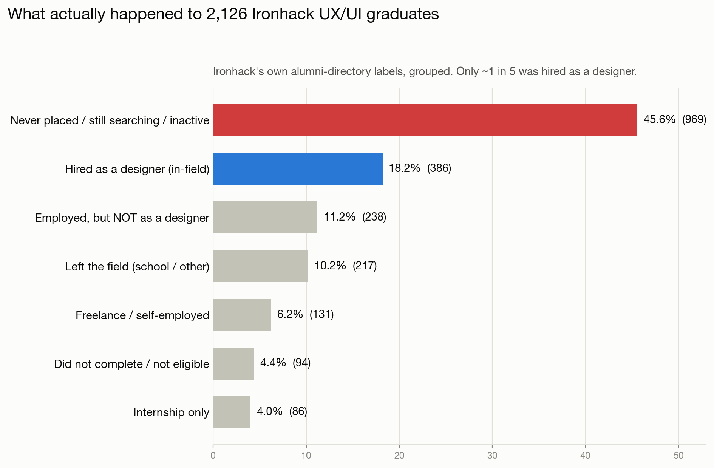
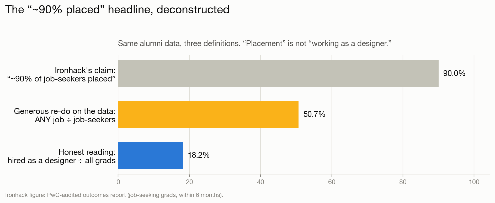
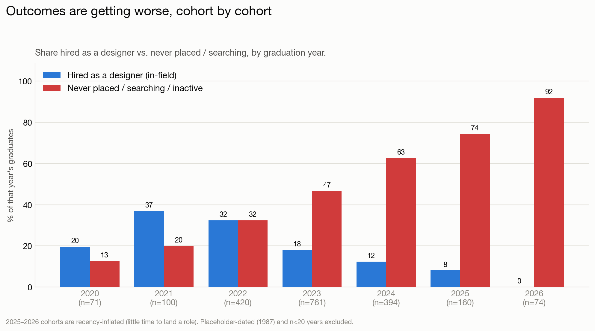
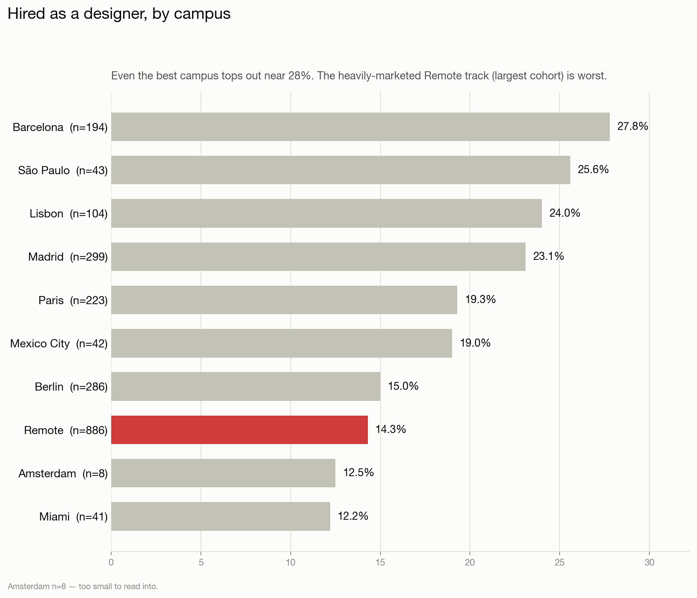
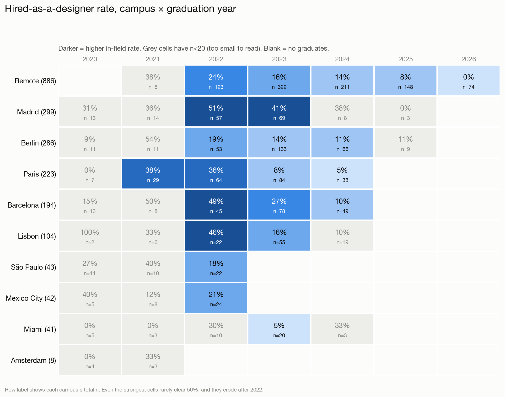

# Does an Ironhack UX/UI bootcamp make you a "high‑paid UX designer"?

**A data look at the outcomes Ironhack itself publishes.**

Ironhack sells its UX/UI bootcamp on placement: *"~90% of job‑seeking graduates placed within 6 months"* (PwC‑audited), *"96% graduation rate"*, salary messaging built around a UX/UI career. This repository checks that promise against **Ironhack's own alumni‑portal directory** — the internal networking/hiring directory that logged‑in alumni see on `my.ironhack.com`, covering every UX/UI graduate across all 10 campuses — and finds a very different picture.

> **This is a data‑journalism exercise built on Ironhack's own system of record.** The source is not a curated public page but Ironhack's **internal alumni directory**, where each graduate's career‑services outcome is logged (accessed with an alumni login). Precisely because it is the internal record and not a marketing showcase, it includes the **full spread of outcomes, failures included** — it is not cherry‑picked. All results here are **aggregate and anonymous** — no individual graduate is named, and no raw personal data is republished. It does **not** allege fraud: it shows the distance between a *marketing impression* ("become a designer") and the *typical documented outcome*, using Ironhack's own status labels taken at face value.

---

## TL;DR

| Metric (all 10 campuses, n = 2,126 UX/UI grads) | Value |
|---|---:|
| **Hired into a salaried design role (in‑field)** | **18.2%** (386) |
| Never placed / still searching / inactive | **45.8%** (974) |
| Ironhack's advertised "placed" rate | ~90% |
| Same "any job ÷ job‑seekers" math, redone on this data | **50.7%** |
| Mature cohorts only (graduated ≥ 12 mo ago), hired in‑field | 19.2% |
| 2023 cohort (n=761, plenty of time), hired in‑field | 18.0% |

**Fewer than 1 in 5 graduates ended up as a working designer.** The advertised "~90% placed" is real only under a narrow definition of *who counts* (job‑seekers only) and a broad definition of *what "placed" means* (any job at all — including non‑design roles and returning to a former employer). And outcomes are **getting worse every cohort**.

---

## What Ironhack promises

- **"We placed 90% of job‑seeking graduates within 6 months"** — PwC‑audited outcomes report.
- **76% placed within 90 days, 89% within 180 days**, across a reported cohort of 829 graduates (322 of them UX/UI).
- **96% graduation rate.**
- Salary messaging pointing at UX/UI pay (Ironhack's own salary blog cites averages such as **€25–35k in Spain**, **€42k in Germany**; US outcomes materials have cited roughly **$65k** starting).

Two words carry the claim: **"job‑seeking"** (the denominator) and **"placed"** (never defined as *in‑field*). The alumni directory lets us see what those words hide.

## Method

- **Source:** `POST my.ironhack.com/api/alumni` — Ironhack's alumni‑portal directory, the internal record logged‑in alumni browse (accessed here with an alumni login). Each record carries Ironhack's own `career_services.status` label. This is Ironhack's system of record, not a public marketing page, so it reports the real outcome distribution including failures.
- **Scope:** every UX/UI (`track=ux`) graduate the directory exposes, across **all 10 campuses** — **n = 2,126**.
- **Ground truth:** we take Ironhack's own status labels at face value and group them into plain‑language buckets. We invent nothing. The full raw‑label → bucket mapping is in the [appendix](#appendix-a--full-status-enumeration-all-24-labels).
- **Recency control:** graduates from the last ~12 months are naturally still "searching," so we report **mature cohorts** (≥ 12 months out, n = 1,999) and a full **year‑by‑year** breakdown separately.
- **Privacy:** all published outputs are counts. Names, photos, and LinkedIn URLs stayed on the analyst's machine and are git‑ignored (see [Ethics & privacy](#ethics--privacy)).

---

## 1. What actually happened

Grouping Ironhack's own labels for all 2,126 UX/UI graduates:

| Outcome (Ironhack's own labels, grouped) | Count | Share |
|---|---:|---:|
| Never placed / still searching / inactive | 974 | **45.8%** |
| **Hired into a salaried design role (in‑field)** | **386** | **18.2%** |
| Employed, but **not** as a designer | 238 | 11.2% |
| Left the field (back to school / other) | 217 | 10.2% |
| Freelance / self‑employed | 131 | 6.2% |
| Did not complete / not eligible | 94 | 4.4% |
| Internship only | 86 | 4.0% |



The single most common raw label is `placement_not_successful` — **584 people, 27.5% of everyone.** More graduates went **back to a previous (non‑design) job** (138) or **back to university** (120) than the marketing would suggest. Twenty‑four ended up **working at Ironhack itself** (`ironhack_employee`).

## 2. How the "~90% placed" headline is manufactured

We can reconstruct Ironhack's generous framing from the same data:

1. **Shrink the denominator.** Drop everyone not "job‑seeking" — inactive, back‑to‑school, didn't‑complete, personal development, withdrew. That removes ~470 people (2,126 → 1,660).
2. **Widen the numerator.** Count **any** employment as a "placement" — in‑field, out‑of‑field, freelance, entrepreneur, internship, or returning to a former employer (841 people).

Even doing **both**, the best we reach is:

| Metric | Result |
|---|---:|
| Ironhack‑style "placed" (any job ÷ job‑seekers), all cohorts | **50.7%** |
| Same, mature cohorts only | 53.7% |
| **Honest headline: hired as a designer ÷ all graduates** | **18.2%** |



So even bending the definitions as far as they'll go, this population lands around **50%, not 90%.** The remaining gap is what "PwC‑audited" quietly absorbs: a specific, time‑boxed, self‑reported reporting cohort — not the full body of alumni Ironhack tracks and displays. The crucial takeaway for a prospective student: **"placement" ≠ "working as a designer."**

## 3. Outcomes by graduation year — the collapse

This is the part the single headline hides. Splitting by graduation year shows the in‑field hire rate **falling cohort after cohort** while "never placed" **balloons**:



| Year | n | Hired in‑field | Not as designer | Freelance | Never placed | Left field | Incomplete | Internship |
|---|---:|---:|---:|---:|---:|---:|---:|---:|
| 2020 | 71 | 19.7% | 22.5% | 8.5% | 12.7% | 32.4% | 4.2% | 0.0% |
| 2021 | 100 | **37.0%** | 12.0% | 10.0% | 20.0% | 14.0% | 1.0% | 6.0% |
| 2022 | 420 | 32.4% | 9.5% | 7.9% | 32.4% | 7.4% | 4.5% | 6.0% |
| 2023 | 761 | 18.0% | 11.4% | 7.9% | 46.6% | 6.2% | 5.8% | 4.1% |
| 2024 | 394 | 12.4% | 8.1% | 2.5% | 62.7% | 3.8% | 5.6% | 4.8% |
| 2025 | 160 | 8.1% | 7.5% | 3.1% | 74.4% | 3.1% | 1.2% | 2.5% |
| 2026 | 74 | 0.0% | 4.1% | 1.4% | 91.9% | 1.4% | 0.0% | 1.4% |

Two things are happening at once, and both matter:

- **Recency** inflates "never placed" for **2025–2026** (those grads have barely had time to land a role) — so don't read too much into the last two bars.
- But the **decline is real and predates recency.** The **2023 cohort (n=761)** graduated 1.5–3 years ago — ample time — and still only **18%** are hired in‑field, with **47% never placed.** The **2022** peak (32%) already halved by 2023. This tracks the well‑documented 2023+ contraction in the junior‑designer job market: a bootcamp certificate that may have worked in 2021 stopped working.

*(Two non‑real "years" — 133 placeholder‑dated `1987` records and 13 records from `2019` — are excluded from the chart; see [data quality](#data-quality-notes).)*

## 4. Outcomes by campus

The in‑field hire rate varies sharply by campus — and the **Remote** program, also the **largest** (886 grads, 42% of the dataset), is among the **worst**:



| Campus | n | Hired in‑field | Never placed / searching |
|---|---:|---:|---:|
| Barcelona | 194 | **27.8%** | 36.1% |
| São Paulo | 43 | 25.6% | 34.9% |
| Lisbon | 104 | 24.0% | 22.1% |
| Madrid | 299 | 23.1% | 20.7% |
| Paris | 223 | 19.3% | 42.6% |
| Mexico City | 42 | 19.0% | 26.2% |
| Berlin | 286 | 15.0% | 55.6% |
| **Remote** | **886** | **14.3%** | **59.1%** |
| Amsterdam | 8 | 12.5% | 0.0% |
| Miami | 41 | 12.2% | 36.6% |

Even the **best** campus (Barcelona) tops out at ~28% hired in‑field. *(Amsterdam n=8 is too small to read into.)*

## 5. The full detail: campus × graduation year

Crossing both dimensions shows exactly **where and when** the bootcamp ever worked. Cells with a reliable sample (n ≥ 20) are coloured by in‑field rate; small‑sample cells (n < 20, shown grey in the chart / *italic* in the table) are too noisy to read.



**In‑field hire rate — % (n) per cell** *(italic = n < 20, small sample; — = no graduates that year)*:

| Campus (total n) | 2020 | 2021 | 2022 | 2023 | 2024 | 2025 | 2026 |
|---|---:|---:|---:|---:|---:|---:|---:|
| **Remote** (886) | — | *38% (8)* | 24% (123) | 16% (322) | 14% (211) | 8% (148) | 0% (74) |
| **Madrid** (299) | *31% (13)* | *36% (14)* | 51% (57) | 41% (69) | *38% (8)* | *0% (3)* | — |
| **Berlin** (286) | *9% (11)* | *54% (11)* | 19% (53) | 14% (133) | 11% (66) | *11% (9)* | — |
| **Paris** (223) | *0% (7)* | 38% (29) | 36% (64) | 8% (84) | 5% (38) | — | — |
| **Barcelona** (194) | *15% (13)* | *50% (8)* | 49% (45) | 27% (78) | 10% (49) | — | — |
| **Lisbon** (104) | *100% (2)* | *33% (6)* | 46% (22) | 16% (55) | *10% (19)* | — | — |
| **São Paulo** (43) | *27% (11)* | *40% (10)* | 18% (22) | — | — | — | — |
| **Mexico City** (42) | *40% (5)* | *12% (8)* | 21% (24) | — | — | — | — |
| **Miami** (41) | *0% (5)* | *0% (3)* | *30% (10)* | 5% (20) | *33% (3)* | — | — |
| **Amsterdam** (8) | *0% (4)* | *33% (3)* | — | — | — | — | — |

Even the strongest, best‑sampled cells — **Madrid 2022 (51%, n=57)**, **Barcelona 2022 (49%, n=45)**, **Madrid 2023 (41%, n=69)** — barely reach a coin‑flip, and only at the 2022 peak. By 2023–2024 every well‑sampled campus has collapsed into the teens (Remote 16→14%, Berlin 14→11%, Paris 8→5%, Barcelona 27→10%). The bootcamp's best years are behind it, on every campus at once.

*(The matching never‑placed cross‑tab is in `data/report_all.json` under `per_campus_year`.)*

## 6. The "freelance" question

A common suspicion is that "freelance UX designer" is often a polite label for *couldn't find a salaried role.* In this data, freelance is a **small** group — **89 people, 4.2%** (131, 6.2%, if you fold in `entrepreneur`) — so it is **not** the main story. But it is strikingly **long‑tenured**: the median freelancer graduated **40 months** ago, and **88 of 89** have been freelance for **24+ months.** That is consistent with (though not proof of) freelancing being a durable destination rather than a short bridge to employment.

## 7. Even the "success" bucket is inflated

The 18% "hired in‑field" figure is itself an *over*count. In at least one case the authors can personally verify, a graduate labelled `hired_in_field` was, in reality:

- **already employed before enrolling** — the role predates the bootcamp entirely, and
- **working as a Product Manager, not a designer**, at a **pre‑existing employer**.

Ironhack still books that person as a UX/UI "designer hired in field." If the flagship success label absorbs people who were already employed, in a different role, before they started, then the true *"became a working designer because of Ironhack"* rate sits **below** the 18% headline.

---

## The "high‑paid" part

This dataset records employment **status**, not pay, so it cannot directly verify "high‑paid." But it doesn't need to: if only ~18% are employed **as designers at all**, the "high‑paid designer" promise is moot for the other ~82%. Ironhack's own salary blog, meanwhile, cites European UX/UI averages in the €25–42k range — modest, and irrelevant to the majority who never enter the field.

## Data quality notes

- **Placeholder dates.** 133 Madrid records share the exact date `1987‑12‑04T00:00:00Z` — a missing‑date sentinel, not a real 1987 cohort. They skew toward `back_to_university` / `back_to_job`. They are **kept** in the population totals (their status labels are valid) but **excluded** from the year‑by‑year chart.
- **Labels are Ironhack's.** We don't know Ironhack's precise internal definition of `placement_not_successful`, or how aggressively `searching`/`inactive` are refreshed.
- **Snapshot in time** (scraped July 2026).
- **Directory ≠ census.** It may not contain 100% of graduates — but as Ironhack's internal record it *does* include failures, drop‑outs, and `withdrew`, so it is not a cherry‑picked success reel; if anything it undercounts the worst outcomes (people who vanish entirely).
- **Access.** The directory sits behind the `my.ironhack.com` alumni login; it is not a public web page. The figures here are Ironhack's own; only aggregate, anonymous counts are republished (see *Ethics & privacy*).

## Limitations

- Employment **status only**, not salary or seniority.
- **UX/UI track only** — web‑dev and data tracks are not covered.
- Self‑reported / possibly stale profiles.
- Recency affects the 2025–2026 cohorts (addressed via the mature‑cohort cut and the year table).

## Appendix A — full status enumeration (all 24 labels)

Every distinct `career_services.status` value in the data, with the bucket it maps to. Nothing is dropped; the buckets are exhaustive and mutually exclusive.

| Raw label | Count | % | Bucket |
|---|---:|---:|---|
| `placement_not_successful` | 584 | 27.5% | Never placed / searching / inactive |
| `hired_in_field` | 386 | 18.2% | **Salaried designer (in‑field)** |
| `searching` | 163 | 7.7% | Never placed / searching / inactive |
| `back_to_job` | 138 | 6.5% | Job, not as a designer |
| `inactive` | 129 | 6.1% | Never placed / searching / inactive |
| `back_to_university` | 120 | 5.6% | Left the field |
| `freelance` | 89 | 4.2% | Freelance / self‑employed |
| `personal_development` | 83 | 3.9% | Left the field |
| `hired_out_of_field` | 76 | 3.6% | Job, not as a designer |
| `not_graduated_cs` | 71 | 3.3% | Did not complete / not eligible |
| `internship` | 68 | 3.2% | Internship only |
| `intervention_careers` | 45 | 2.1% | Never placed / searching / inactive |
| `entrepreneur` | 42 | 2.0% | Freelance / self‑employed |
| `intervention_education` | 25 | 1.2% | Never placed / searching / inactive |
| `ironhack_employee` | 24 | 1.1% | Job, not as a designer |
| `not_eligible` | 23 | 1.1% | Did not complete / not eligible |
| `short_term` | 18 | 0.8% | Internship only |
| `deferred_more_than_45d` | 14 | 0.7% | Never placed / searching / inactive |
| `withdrew` | 14 | 0.7% | Left the field |
| `intervention_careers_not_success` | 5 | 0.2% | Never placed / searching / inactive |
| `pending` | 4 | 0.2% | Never placed / searching / inactive |
| `deferred_less_than_45d` | 3 | 0.1% | Never placed / searching / inactive |
| `deferred_more_than_45d_sc` | 1 | 0.0% | Never placed / searching / inactive |
| `intervention_education_not_success` | 1 | 0.0% | Never placed / searching / inactive |

## Reproduce

```bash
# 1. Log in to the Ironhack alumni portal (requires an alumni account), then copy a
#    fresh x-csrf-token from the Network tab. It is short-lived.
export IRONHACK_CSRF="<token>"

# 2. Scrape every campus (ux track).
for c in rmt par mad bcn ber mia lis ams sao mex; do
  python3 scrape.py --track ux --campus "$c"
done

# 3. Aggregate + chart.
python3 analyze_all.py     # -> data/report_all.json + console tables
python3 make_charts.py     # -> assets/*.png
```

## Files

| File | What it is |
|---|---|
| `scrape.py` | Collects the alumni‑portal directory into local JSONL + CSV (token via `IRONHACK_CSRF` env) |
| `analyze.py` | Single‑campus aggregate stats |
| `analyze_all.py` | Combined analysis across all campuses → `data/report_all.json` |
| `make_charts.py` | Renders the four infographics in `assets/` |
| `data/report_all.json` | The aggregate, **anonymous** result set (counts only) |
| `assets/*.png` | The charts |

## Ethics & privacy

- The source is **Ironhack's own alumni‑portal directory**, accessed with an alumni login — Ironhack's internal system of record, not a public page.
- **Nothing identifying is republished.** All published outputs are **aggregate and anonymous** counts. Raw per‑person data (names, LinkedIn URLs, photos) is **git‑ignored** and never leaves the analyst's machine. The purpose is the public interest of prospective students weighing the bootcamp's marketing claims against its own recorded outcomes.
- Status labels are **Ironhack's own**, taken at face value. This is a comparison between a marketing impression and the typical documented outcome — not an allegation of fraud. See *Limitations* and *Data quality notes* above.

## License

Underlying data is Ironhack's; the analysis, code, and charts here are released under the MIT License.
