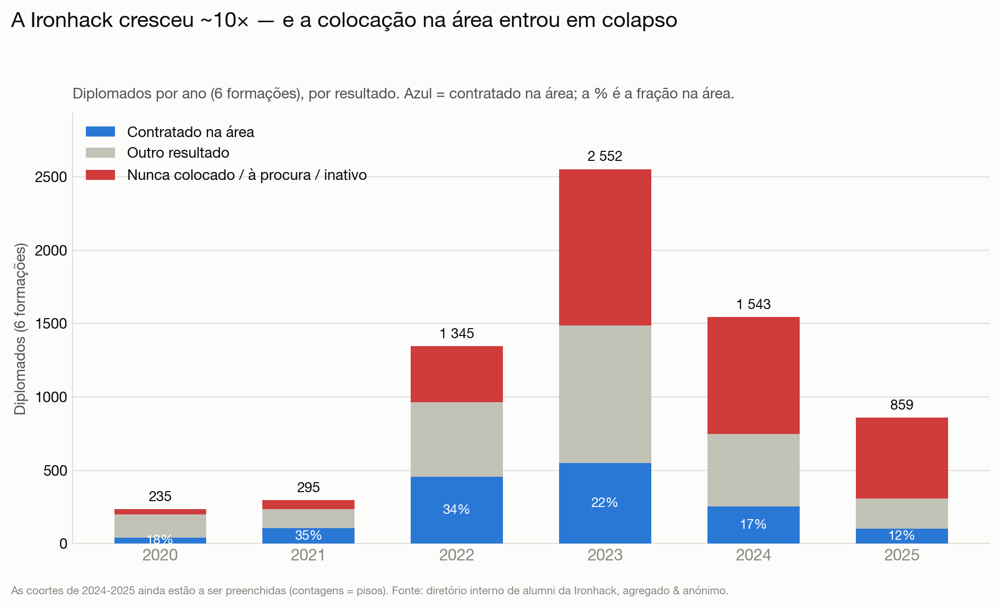
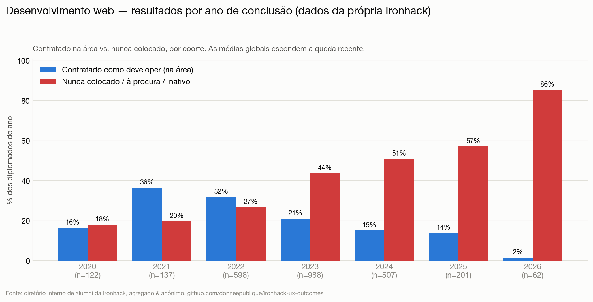
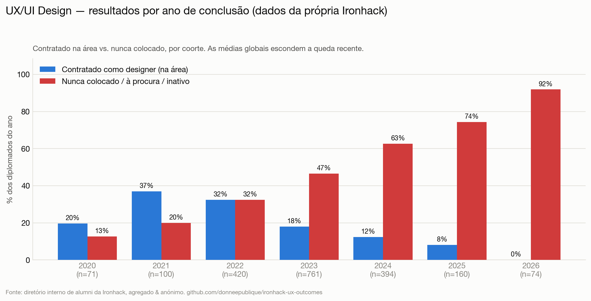
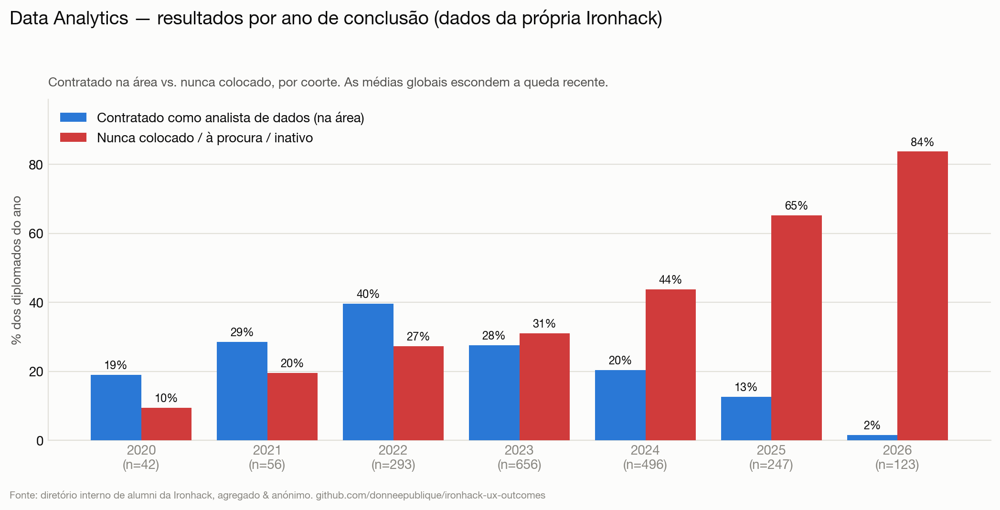
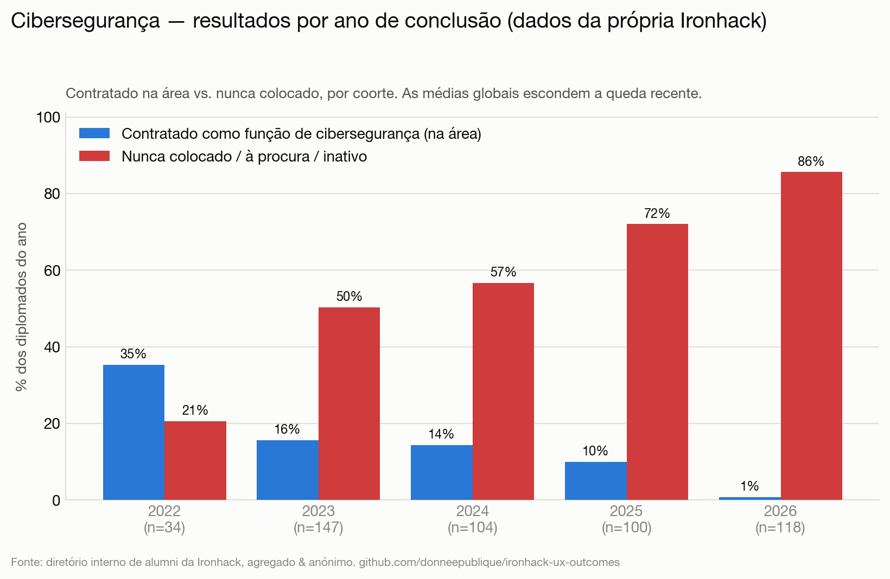
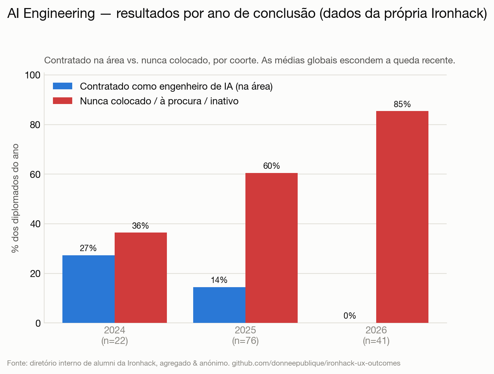
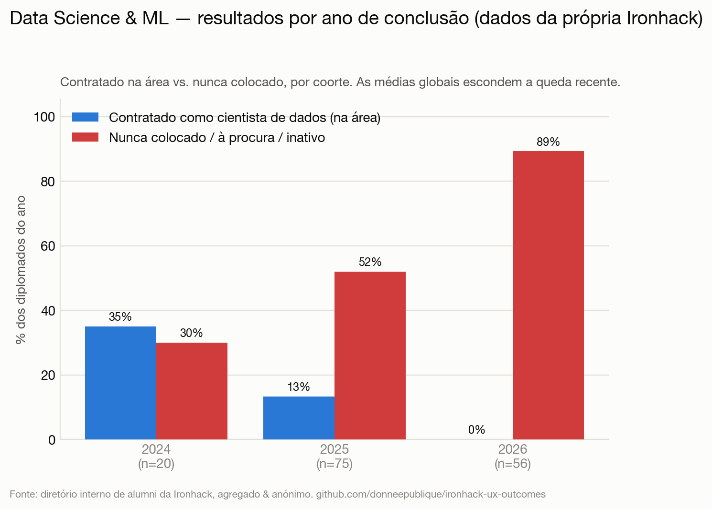

# Resultados dos bootcamps da Ironhack: ~10× mais alunos, colocação em colapso — segundo os seus próprios dados

[English](README.md) · [Français](README.fr.md) · [Deutsch](README.de.md) · 🌍 **Português**

**O que realmente acontece após um bootcamp da Ironhack — nas 6 formações, coorte a coorte — a partir do diretório interno de alumni da Ironhack.**

> Exercício de jornalismo de dados sobre o **registo da própria Ironhack**: o diretório de alumni (`my.ironhack.com`) onde a Ironhack regista o resultado de colocação de cada diplomado (acesso com conta de alumni). Sendo o registo interno e não uma página de marketing, inclui também os insucessos. Tudo é **agregado e anónimo** — ninguém identificado, nenhum dado pessoal em bruto republicado. **Não** é uma acusação de fraude. A história não é um número único, é uma **tendência**: quando a Ironhack atingiu as suas maiores coortes e lançou novas formações premium, a fração de diplomados efetivamente contratados *na área* entrou em colapso.

## Índice

- [Visão geral](#visão-geral) — as 6 formações: escala e queda
- **Por bootcamp:**
  - [Desenvolvimento web](#desenvolvimento-web)
  - [UX/UI Design](#uxui-design)
  - [Data Analytics](#data-analytics)
  - [Cibersegurança](#cibersegurança)
  - [AI Engineering](#ai-engineering)
  - [Data Science & ML](#data-science--ml)
- [O número dos 90%](#o-número-dos-90)
- [Método](#método) · [Limitações](#limitações) · [Proveniência](#proveniência--prova-de-integridade) · [Ética](#ética--privacidade)

---

## Visão geral

A Ironhack passou de algumas centenas de diplomados por ano para **milhares** — e no mesmo período, a fração efetivamente contratada *na área* caiu de ~35% para ~11%.

| Ano de conclusão | Diplomados (6 formações) | Contratados na área | Nunca colocados / à procura |
|---|---:|---:|---:|
| 2020 | 235 | 17% | 14% |
| 2021 | 295 | **35%** | 19% |
| 2022 | 1345 | 33% | 28% |
| 2023 | 2552 | 21% | 41% |
| 2024 | 1543 | 16% | 51% |
| 2025 | 859 | **11%** | 64% |

Dois fenómenos em simultâneo, e é a sua conjugação que conta:

- **Escala.** As coortes anuais multiplicaram-se por **~10** entre 2020 e o pico de 2022‑2023 — as maiores da história da Ironhack.
- **Colapso.** A colocação na área caiu todos os anos após o boom de 2021 — de 35% para ~11%.

As maiores coortes de sempre são, portanto, as de piores resultados. Em absoluto, **só a turma de 2023 tem 1066 diplomados «nunca colocados»**, contra 35 em 2020. *(As contagens de 2024‑2025 são pisos — o diretório ainda está a ser preenchido para os anos recentes — pelo que é a **taxa** de colocação a cair, não a contagem, o sinal fiável.)*

Em **≈7700 diplomados nas 6 formações**, o padrão repete-se em todo o lado. Por formação:

## Desenvolvimento web

**2832 diplomados.** Contratados como developer na área: 2021 **36%** → 2022 32% → 2023 21% → 2024 15% → **2025 14%**, com **44–57%** das duas últimas coortes nunca colocadas.

## UX/UI Design

**2126 diplomados.** Contratados como designer: 2021 **37%** → 2023 18% → 2024 12% → **2025 8%**, com **63–74%** das coortes recentes nunca colocadas. É também a formação com o detalhe mais fino por campus — o campus remoto (o maior) é o mais fraco.

## Data Analytics

**1954 diplomados.** A formação *mais forte* da Ironhack — e mesmo assim em colapso: 2022 **40%** → 2023 28% → 2024 20% → **2025 13%** (65% nunca colocados).

## Cibersegurança

**505 diplomados.** 2022 35% → 2023 16% → 2024 14% → **2025 10%** na área, com **57–72%** das coortes recentes nunca colocadas.

## AI Engineering

**139 diplomados** (a formação mais recente e cara). **Turma de 2025: 14% contratados na área, 60% nunca colocados** (n=76). Lançada exatamente quando o mercado virou.

## Data Science & ML

**151 diplomados.** **Turma de 2025: 13% na área, 52% nunca colocados** (n=75) — a taxa mais baixa de todas as formações.

---

## O número dos 90%

Por volta de **2019**, o *primeiro* relatório de resultados da Ironhack (apresentado como auditado pela PwC) anunciava *«we placed 90% of job‑seeking graduates within 6 months»* (76% / 89% aos 90 / 180 dias). Esse número assentava em dois truques: um **denominador estreito** (só os «à procura») e um **numerador amplo** («colocado» = *qualquer* emprego, incluindo fora da área ou regresso a um empregador anterior). Reconstruído generosamente sobre o conjunto dos dados, chega‑se a ~**51%**, não 90%; contando apenas *contratados como designer ÷ todos os diplomados*, é **18%** (UX/UI, total) — e muito menos nas coortes recentes. Este número, **com cerca de seis anos e anterior à retração do mercado**, já **não é exibido** (a página redireciona; cópia de 2022 na [Wayback Machine](http://web.archive.org/web/20220126230803/https://www.ironhack.com/en/news/ironhack-student-outcomes-report-audited-by-pwc)); a comunicação atual é mais prudente («pay once you get a job», «land your first role»). Não é o cerne do relatório; a **tendência e a escala** são.

## Método

- **Fonte:** `POST my.ironhack.com/api/alumni` — o diretório interno de alumni da Ironhack (acesso com conta de alumni), o seu registo do `career_services.status` de cada diplomado. Não é uma página pública, pelo que reflete a verdadeira distribuição de resultados, insucessos incluídos.
- **Âmbito:** as 6 formações (ux, wd, da, cy, ai, ml), todos os campus — **≈7700 diplomados**.
- **Verdade de base:** os rótulos da própria Ironhack, agrupados em categorias claras. «Na área» = `hired_in_field`; «nunca colocado / à procura» agrupa `placement_not_successful`, `searching`, `inactive`, `intervention_*`, `deferred_*`, `pending`. Correspondência completa abaixo.
- **Por ano:** as coortes são separadas por ano de conclusão para que as turmas recentes não fiquem escondidas nas médias da era do boom.
- **Privacidade:** apenas contagens são publicadas.

Correspondência completa estado → categoria

| Categoria | Valores brutos `career_services.status` |
|---|---|
| Contratado na área | `hired_in_field` |
| Empregado, fora da área | `hired_out_of_field`, `back_to_job`, `ironhack_employee` |
| Freelancer / por conta própria | `freelance`, `entrepreneur` |
| Apenas estágio | `internship`, `short_term` |
| Nunca colocado / à procura / inativo | `placement_not_successful`, `searching`, `inactive`, `intervention_careers`, `intervention_careers_not_success`, `intervention_education`, `intervention_education_not_success`, `deferred_more_than_45d`, `deferred_more_than_45d_sc`, `deferred_less_than_45d`, `pending` |
| Saiu da área | `back_to_university`, `personal_development`, `withdrew` |
| Não concluiu / não elegível | `not_graduated_cs`, `not_eligible` |

## Limitações

- **Rótulos da Ironhack**, tomados à letra; definição interna exata de `placement_not_successful` desconhecida, tal como a frequência de atualização de `searching`/`inactive`.
- **Instantâneo** (julho de 2026); as coortes recentes (2024‑2026) ainda estão a ser preenchidas, as suas **contagens são pisos** — o sinal fiável é a **taxa** de colocação em queda, e as coortes maduras (2021‑2023, 1,5–5 anos depois) já mostram o colapso.
- Alguns registos têm data de preenchimento (`1987`, Madrid) — excluídos dos gráficos por ano, mantidos nos totais.

## Proveniência & prova de integridade

A recolha é resumida numa raiz de Merkle e **datada por uma autoridade RFC 3161 independente** — não pode ser reescrita discretamente e sobrevive a uma eliminação posterior pela Ironhack. Os dados em bruto podem ser fornecidos **a pedido a entidades de financiamento ou fiscalização legítimas** para verificação. Modelo de ameaça + verificação: [PROVENANCE.md](PROVENANCE.md).

## Ética & privacidade

- Fonte: o **diretório interno de alumni** da Ironhack, acedido com conta de alumni — o seu registo, não uma página pública.
- **Nada identificável é republicado** — apenas contagens agregadas e anónimas. Dados em bruto por pessoa (nomes, LinkedIn, fotos) estão git‑ignored e nunca saem da máquina do analista.
- Os **rótulos da Ironhack**, à letra — uma comparação entre marketing e resultados documentados, não uma acusação de fraude.

## Licença

Os dados subjacentes pertencem à Ironhack; a análise, o código e os gráficos são disponibilizados sob a licença MIT.
