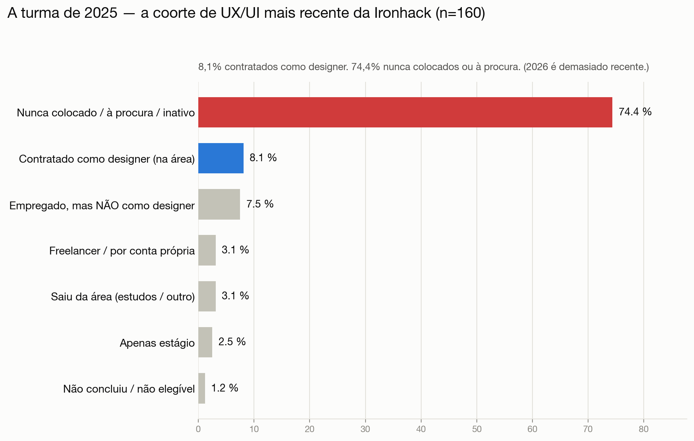
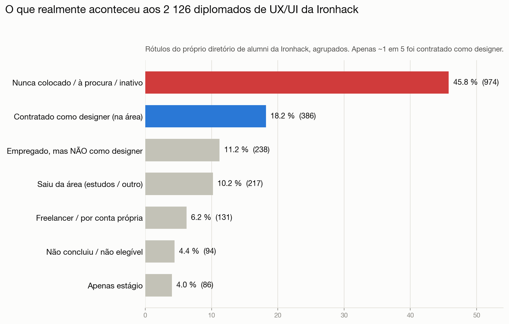
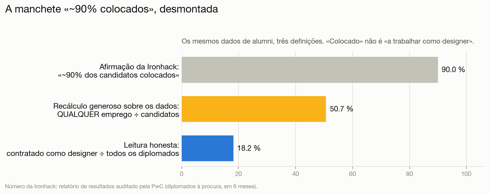
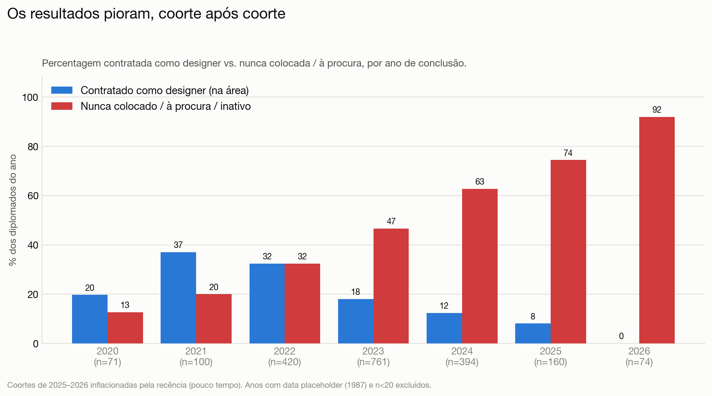
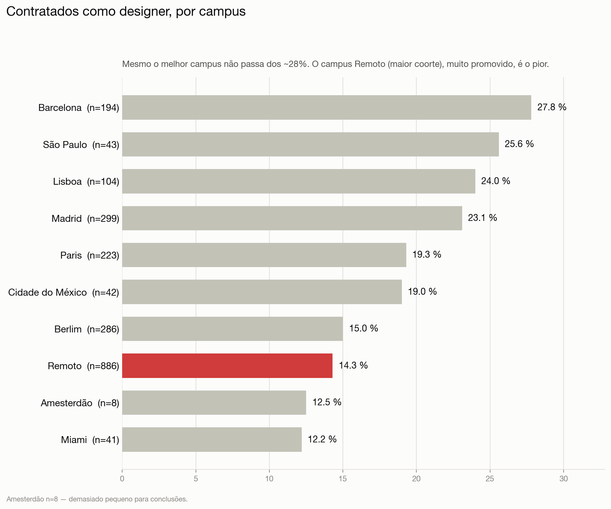
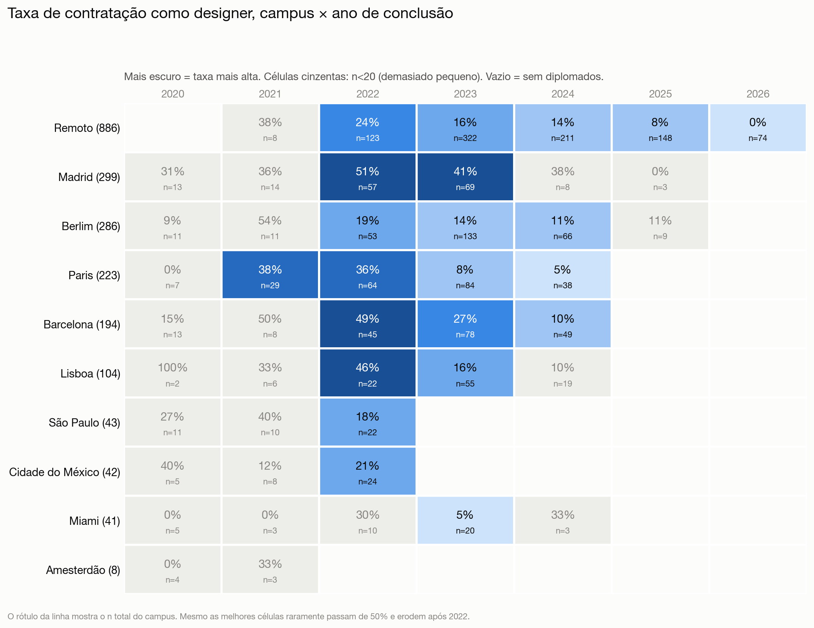

# Um bootcamp de UX/UI da Ironhack faz de si um·a «UX designer bem pago·a»?

[English](README.md) · [Français](README.fr.md) · [Deutsch](README.de.md) · 🌍 **Português**

**Uma leitura com dados dos resultados que a própria Ironhack publica.**

A Ironhack vende o seu bootcamp de UX/UI com base na colocação: *«~90% dos diplomados à procura colocados em 6 meses»* (auditado pela PwC), *«96% de taxa de conclusão»*, com um discurso salarial em torno de uma carreira de UX/UI. Este repositório confronta essa promessa com o **diretório interno de alumni da Ironhack** — o diretório de networking/recrutamento que os antigos alunos autenticados veem em `my.ironhack.com`, abrangendo todos os diplomados de UX/UI dos 10 campus — e o quadro é muito diferente.

> **Exercício de jornalismo de dados assente no próprio registo da Ironhack.** A fonte não é uma página de marketing selecionada, mas o **diretório interno de alumni** da Ironhack, onde o resultado de colocação de cada diplomado é registado (acesso através de uma conta de alumni). Precisamente por ser o registo interno e não uma montra, contém **todo o leque de resultados, incluindo insucessos** — nada é filtrado. Todos os resultados aqui são **agregados e anónimos**: ninguém é identificado, nenhum dado pessoal em bruto é republicado. **Não** é uma acusação de fraude: mostra a distância entre uma *impressão de marketing* («torne-se designer») e o *resultado tipicamente documentado*, tomando à letra os próprios rótulos de estado da Ironhack.

---

## ⚠️ Coorte mais recente com dados — a turma de 2025

> **Dos 160 diplomados de UX/UI de 2025, apenas 8,1% foram contratados como designer; 74,4% nunca foram colocados ou continuam à procura.** 2025 é o ano mais recente com dados significativos — os diplomados de 2026 são excluídos (demasiado recentes; a Ironhack ainda não terminou de registar os seus resultados).
>
> *Para uma comparação estabilizada, a turma de 2023 (18+ meses depois, n=761) também chega apenas a 18% contratados na área — logo, um declínio duradouro, não apenas recém-diplomados.*

## Em resumo

| Indicador (10 campus, n = 2126 diplomados de UX/UI) | Valor |
|---|---:|
| **Contratado·a como designer assalariado·a (na área)** | **18,2%** (386) |
| Nunca colocado·a / ainda à procura / inativo·a | **45,8%** (974) |
| Taxa «colocado» anunciada pela Ironhack | ~90% |
| O mesmo cálculo «qualquer emprego ÷ candidatos», refeito com estes dados | **50,7%** |
| Apenas coortes maduras (concluídas há ≥ 12 meses), contratadas na área | 19,2% |
| Coorte de 2023 (n=761, tempo mais que suficiente), contratada na área | 18,0% |

**Menos de 1 diplomado em cada 5 tornou-se designer em exercício.** Os «~90% colocados» só se sustentam sob uma definição estreita de *quem conta* (apenas quem procura) e uma definição ampla de «colocado» (qualquer emprego — incluindo fora da área ou regresso a um empregador anterior). E os resultados **pioram a cada coorte**.

---

## O que a Ironhack promete

- **«Colocámos 90% dos diplomados à procura em 6 meses»** — relatório de resultados auditado pela PwC.
- **76% colocados em 90 dias, 89% em 180 dias**, numa coorte declarada de 829 diplomados (322 dos quais de UX/UI).
- **96% de taxa de conclusão.**
- Discurso salarial em torno de UX/UI (o próprio blogue de salários da Ironhack cita, p. ex., **25–35 mil € em Espanha**, **42 mil € na Alemanha**; materiais dos EUA citaram ~**65 000 $** iniciais).

Duas palavras sustentam a afirmação: **«à procura»** (o denominador) e **«colocado»** (nunca definido como *na área*). O diretório de alumni revela o que essas palavras escondem.

**As alegações, capturadas.** O relatório de resultados «auditado pela PwC» da Ironhack afirmava *«we placed 90% of job-seeking graduates within 6 months»* (e 76% / 89% aos 90 / 180 dias); a página atual do curso publicita *«pay once you get a job»* e *«land your first role in tech»*, enquanto a página Career Services apresenta Google, Amazon, Meta e Uber como empregadores onde *«Ironhackers now work»*. Relatório arquivado: [Wayback, 2022](http://web.archive.org/web/20220126230803/https://www.ironhack.com/en/news/ironhack-student-outcomes-report-audited-by-pwc).

## Método

- **Fonte:** `POST my.ironhack.com/api/alumni` — o diretório interno de alumni da Ironhack, o registo que os antigos alunos autenticados consultam (acesso aqui através de uma conta de alumni). Cada registo tem o rótulo `career_services.status` da própria Ironhack. É o registo da Ironhack, não uma página pública, pelo que reflete a verdadeira distribuição de resultados, insucessos incluídos.
- **Âmbito:** todos os diplomados de UX/UI (`track=ux`) que o diretório expõe, nos **10 campus** — **n = 2126**.
- **Verdade de base:** tomam-se os rótulos da Ironhack à letra, agrupados em categorias em linguagem clara. Nada é inventado. A correspondência rótulo bruto → categoria está no [anexo](#anexo-a--enumeração-completa-dos-estados-24-rótulos).
- **Controlo de recência:** os diplomados dos últimos ~12 meses estão naturalmente ainda «à procura»; por isso reportam-se em separado as **coortes maduras** (≥ 12 meses, n = 1999) e uma repartição **ano a ano**.
- **Privacidade:** todos os resultados publicados são contagens. Nomes, fotografias e URLs de LinkedIn ficaram na máquina do analista e estão excluídos do repositório (git-ignore).

---

## 1. O que realmente aconteceu

Agrupando os próprios rótulos da Ironhack para os 2126 diplomados de UX/UI:

| Resultado (rótulos da Ironhack, agrupados) | Nº | Parte |
|---|---:|---:|
| Nunca colocado / ainda à procura / inativo | 974 | **45,8%** |
| **Contratado como designer assalariado (na área)** | **386** | **18,2%** |
| Empregado, mas **não** como designer | 238 | 11,2% |
| Saiu da área (regresso aos estudos / outro) | 217 | 10,2% |
| Freelancer / por conta própria | 131 | 6,2% |
| Não concluiu / não elegível | 94 | 4,4% |
| Apenas estágio | 86 | 4,0% |

O rótulo bruto mais frequente é `placement_not_successful` — **584 pessoas, 27,5% do total.** Mais diplomados **regressaram a um emprego anterior (fora do design)** (138) ou **voltaram à universidade** (120) do que o marketing sugere. Vinte e quatro acabaram a **trabalhar na própria Ironhack** (`ironhack_employee`).

## 2. Como a manchete «~90% colocados» é fabricada

O enquadramento generoso da Ironhack pode ser reconstruído a partir dos mesmos dados:

1. **Encolher o denominador.** Remover todos os que não estão «à procura» — inativos, regresso aos estudos, não concluíram, desenvolvimento pessoal, desistências. Isto remove ~470 pessoas (2126 → 1660).
2. **Alargar o numerador.** Contar **qualquer** emprego como «colocação» — na área, fora da área, freelancer, empreendedor, estágio ou regresso a um empregador anterior (841 pessoas).

Mesmo fazendo **ambos**, o máximo que se atinge é:

| Indicador | Resultado |
|---|---:|
| «Colocado» à maneira da Ironhack (qualquer emprego ÷ candidatos), todas as coortes | **50,7%** |
| O mesmo, apenas coortes maduras | 53,7% |
| **Leitura honesta: contratado como designer ÷ todos os diplomados** | **18,2%** |

Ou seja, mesmo esticando as definições ao máximo, esta população fica em cerca de **50%, não 90%.** A lacuna restante é o que o «auditado pela PwC» absorve discretamente: uma coorte de reporte específica, limitada no tempo e autodeclarada — não o conjunto de alumni que a Ironhack segue e exibe. O ponto crucial para um·a futuro·a estudante: **«colocação» ≠ «a trabalhar como designer».**

## 3. Resultados por ano de conclusão — o colapso

É isto que a manchete única esconde. Repartindo por ano, a taxa de contratação na área **cai de coorte em coorte** enquanto «nunca colocado» **dispara**:

Coortes mais recentes primeiro:

| Ano | n | Na área | Não como designer | Freelancer | Nunca colocado | Saiu da área | Não concluiu | Estágio |
|---|---:|---:|---:|---:|---:|---:|---:|---:|
| 2026 | 74 | 0,0% | 4,1% | 1,4% | 91,9% | 1,4% | 0,0% | 1,4% |
| **2025** | **160** | **8,1%** | **7,5%** | **3,1%** | **74,4%** | **3,1%** | **1,2%** | **2,5%** |
| 2024 | 394 | 12,4% | 8,1% | 2,5% | 62,7% | 3,8% | 5,6% | 4,8% |
| 2023 | 761 | 18,0% | 11,4% | 7,9% | 46,6% | 6,2% | 5,8% | 4,1% |
| 2022 | 420 | 32,4% | 9,5% | 7,9% | 32,4% | 7,4% | 4,5% | 6,0% |
| 2021 | 100 | **37,0%** | 12,0% | 10,0% | 20,0% | 14,0% | 1,0% | 6,0% |
| 2020 | 71 | 19,7% | 22,5% | 8,5% | 12,7% | 32,4% | 4,2% | 0,0% |
| *2019* | *13* | *0,0%* | *23,1%* | *7,7%* | *15,4%* | *53,8%* | *0,0%* | *0,0%* |

Dois fenómenos acontecem ao mesmo tempo, e ambos contam:

- A **recência** inflaciona «nunca colocado» para **2025–2026** (esses diplomados tiveram pouco tempo para encontrar emprego) — logo, não sobreinterpretar as duas últimas linhas.
- Mas o **declínio é real e anterior à recência.** A coorte **2023 (n=761)** concluiu há 1,5 a 3 anos — tempo mais que suficiente — e regista apenas **18%** na área, com **47% nunca colocados.** O pico de **2022** (32%) já tinha sido reduzido a metade em 2023. Isto acompanha a contração bem documentada do mercado de design júnior a partir de 2023: um certificado de bootcamp que talvez funcionasse em 2021 deixou de funcionar.

*(Tabela do mais recente para o mais antigo. `2019` (n=13, em itálico) é mostrado mas demasiado pequeno para pesar; os 133 registos com data `1987` são um artefacto de data em falta, não uma coorte real — ambos são excluídos do gráfico. Ver [qualidade dos dados](#notas-sobre-a-qualidade-dos-dados).)*

## 4. Resultados por campus

A taxa de contratação na área varia muito consoante o campus — e o programa **Remoto**, também o **maior** (886 diplomados, 42% do conjunto), está entre os **piores**:

| Campus | n | Na área | Nunca colocado / à procura |
|---|---:|---:|---:|
| Barcelona | 194 | **27,8%** | 36,1% |
| São Paulo | 43 | 25,6% | 34,9% |
| Lisboa | 104 | 24,0% | 22,1% |
| Madrid | 299 | 23,1% | 20,7% |
| Paris | 223 | 19,3% | 42,6% |
| Cidade do México | 42 | 19,0% | 26,2% |
| Berlim | 286 | 15,0% | 55,6% |
| **Remoto** | **886** | **14,3%** | **59,1%** |
| Amesterdão | 8 | 12,5% | 0,0% |
| Miami | 41 | 12,2% | 36,6% |

Mesmo o **melhor** campus (Barcelona) não passa dos ~28% na área. *(Amesterdão n=8 é demasiado pequeno para conclusões.)*

## 5. O detalhe: campus × ano de conclusão

Cruzar as duas dimensões mostra exatamente **onde e quando** o bootcamp funcionou. As células com amostra fiável (n ≥ 20) são coloridas pela taxa; as de amostra pequena (n < 20, cinzentas no gráfico / *em itálico* na tabela) são demasiado ruidosas.

**Taxa de contratação na área — % (n) por célula** *(itálico = n < 20, amostra pequena; — = sem diplomados nesse ano)*:

| Campus (n total) | 2020 | 2021 | 2022 | 2023 | 2024 | 2025 | 2026 |
|---|---:|---:|---:|---:|---:|---:|---:|
| **Remoto** (886) | — | *38% (8)* | 24% (123) | 16% (322) | 14% (211) | 8% (148) | 0% (74) |
| **Madrid** (299) | *31% (13)* | *36% (14)* | 51% (57) | 41% (69) | *38% (8)* | *0% (3)* | — |
| **Berlim** (286) | *9% (11)* | *54% (11)* | 19% (53) | 14% (133) | 11% (66) | *11% (9)* | — |
| **Paris** (223) | *0% (7)* | 38% (29) | 36% (64) | 8% (84) | 5% (38) | — | — |
| **Barcelona** (194) | *15% (13)* | *50% (8)* | 49% (45) | 27% (78) | 10% (49) | — | — |
| **Lisboa** (104) | *100% (2)* | *33% (6)* | 46% (22) | 16% (55) | *10% (19)* | — | — |
| **São Paulo** (43) | *27% (11)* | *40% (10)* | 18% (22) | — | — | — | — |
| **Cidade do México** (42) | *40% (5)* | *12% (8)* | 21% (24) | — | — | — | — |
| **Miami** (41) | *0% (5)* | *0% (3)* | *30% (10)* | 5% (20) | *33% (3)* | — | — |
| **Amesterdão** (8) | *0% (4)* | *33% (3)* | — | — | — | — | — |

Mesmo as melhores células com boa amostra — **Madrid 2022 (51%, n=57)**, **Barcelona 2022 (49%, n=45)**, **Madrid 2023 (41%, n=69)** — mal chegam a um cara-ou-coroa, e só no pico de 2022. A partir de 2023–2024, cada campus bem amostrado cai para valores na casa dos 10%.

## 6. A questão do «freelancer»

Suspeita-se muitas vezes que «UX designer freelancer» é uma forma educada de dizer *não encontrou um posto assalariado.* Aqui, o freelancing é um grupo **pequeno** — **89 pessoas, 4,2%** (131, 6,2% incluindo `entrepreneur`) — pelo que **não** é o essencial. Mas é surpreendentemente **antigo**: o freelancer mediano concluiu há **40 meses**, e **88 em 89** são freelancers há **24 meses ou mais.** Isto é compatível com (embora não prove) o freelancing como destino duradouro e não como ponte temporária para o emprego.

## 7. Até a categoria «sucesso» está inflacionada

Os 18% «contratados na área» são eles próprios uma *sobre*estimativa. Em pelo menos um caso que os autores podem verificar pessoalmente, uma pessoa rotulada como `hired_in_field` era, na realidade:

- **já empregada antes da inscrição** — o cargo é anterior ao bootcamp, e
- **Product Manager, não designer**, num **empregador preexistente**.

A Ironhack contabiliza essa pessoa na mesma como «designer contratado na área». Se a categoria-bandeira de sucesso absorve pessoas que já estavam empregadas, noutra função, antes sequer de começar, então a verdadeira taxa *«tornou-se designer em exercício graças à Ironhack»* fica **abaixo** dos 18% anunciados.

---

## A parte «bem pago»

Este conjunto de dados regista o **estado** de emprego, não a remuneração, pelo que não pode verificar diretamente «bem pago». Mas não precisa: se apenas ~18% estão empregados **como designers de todo**, a promessa do «designer bem pago» é irrelevante para os restantes ~82%. Além disso, o próprio blogue de salários da Ironhack cita médias europeias de UX/UI de 25–42 mil € — modestas, e irrelevantes para a maioria que nunca entra na área.

## Notas sobre a qualidade dos dados

- **Datas de preenchimento.** 133 registos de Madrid partilham exatamente a data `1987-12-04T00:00:00Z` — um sentinela de «data em falta», não uma coorte real de 1987. Tendem para `back_to_university` / `back_to_job`. São **mantidos** nos totais (os rótulos de estado são válidos) mas **excluídos** do gráfico por ano.
- **Rótulos da Ironhack.** Não se conhece a definição interna exata de `placement_not_successful`, nem a frequência de atualização de `searching`/`inactive`.
- **Instantâneo datado** (recolha em julho de 2026).
- **Diretório ≠ censo.** Pode não conter 100% dos diplomados — mas, sendo o registo interno da Ironhack, inclui insucessos, desistências e `withdrew`; não é uma seleção de sucessos; a haver enviesamento, subestima os piores resultados (pessoas que desaparecem por completo).
- **Acesso.** O diretório está por trás do login de alumni `my.ironhack.com`; não é uma página web pública. Os números são da Ironhack; apenas contagens agregadas e anónimas são republicadas.

## Limitações

- **Apenas** estado de emprego, nem salário nem senioridade.
- **Apenas track de UX/UI** — os cursos de web-dev e data não são cobertos aqui.
- Perfis autodeclarados, possivelmente desatualizados.
- A recência afeta as coortes 2025–2026 (tratado através do corte de coortes maduras e da tabela por ano).

## Proveniência & prova de integridade

Podemos provar que recolhemos mesmo isto da Ironhack, que os números não foram alterados, e que a prova sobrevive se a Ironhack apagar o diretório mais tarde? Em grande medida, sim. A recolha é resumida (hash) numa raiz de Merkle, ela própria **assinada por uma autoridade de datação RFC 3161 independente**, o que a congela no tempo — depois disso, nenhuma eliminação ou alteração por parte da Ironhack pode mudar o que podemos provar. Modelo de ameaça completo, limites honestos (uma prova de origem transferível exige TLSNotary/zkTLS) e verificação passo a passo em **[PROVENANCE.md](PROVENANCE.md)**.

## Anexo A — enumeração completa dos estados (24 rótulos)

Cada valor distinto de `career_services.status`, com a categoria associada. Nada é omitido; as categorias são exaustivas e mutuamente exclusivas.

| Rótulo bruto | Nº | % | Categoria |
|---|---:|---:|---|
| `placement_not_successful` | 584 | 27,5% | Nunca colocado / à procura / inativo |
| `hired_in_field` | 386 | 18,2% | **Designer assalariado (na área)** |
| `searching` | 163 | 7,7% | Nunca colocado / à procura / inativo |
| `back_to_job` | 138 | 6,5% | Empregado, não como designer |
| `inactive` | 129 | 6,1% | Nunca colocado / à procura / inativo |
| `back_to_university` | 120 | 5,6% | Saiu da área |
| `freelance` | 89 | 4,2% | Freelancer / por conta própria |
| `personal_development` | 83 | 3,9% | Saiu da área |
| `hired_out_of_field` | 76 | 3,6% | Empregado, não como designer |
| `not_graduated_cs` | 71 | 3,3% | Não concluiu / não elegível |
| `internship` | 68 | 3,2% | Apenas estágio |
| `intervention_careers` | 45 | 2,1% | Nunca colocado / à procura / inativo |
| `entrepreneur` | 42 | 2,0% | Freelancer / por conta própria |
| `intervention_education` | 25 | 1,2% | Nunca colocado / à procura / inativo |
| `ironhack_employee` | 24 | 1,1% | Empregado, não como designer |
| `not_eligible` | 23 | 1,1% | Não concluiu / não elegível |
| `short_term` | 18 | 0,8% | Apenas estágio |
| `deferred_more_than_45d` | 14 | 0,7% | Nunca colocado / à procura / inativo |
| `withdrew` | 14 | 0,7% | Saiu da área |
| `intervention_careers_not_success` | 5 | 0,2% | Nunca colocado / à procura / inativo |
| `pending` | 4 | 0,2% | Nunca colocado / à procura / inativo |
| `deferred_less_than_45d` | 3 | 0,1% | Nunca colocado / à procura / inativo |
| `deferred_more_than_45d_sc` | 1 | 0,0% | Nunca colocado / à procura / inativo |
| `intervention_education_not_success` | 1 | 0,0% | Nunca colocado / à procura / inativo |

## Ética & privacidade

- A fonte é o **diretório interno de alumni da Ironhack**, acedido com uma conta de alumni — o registo da Ironhack, não uma página pública.
- **Nada identificável é republicado.** Todos os resultados publicados são contagens agregadas e anónimas. Os dados em bruto por pessoa (nomes, URLs de LinkedIn, fotografias) estão **git-ignored** e nunca saem da máquina do analista. O objetivo é o interesse público dos futuros estudantes e das entidades financiadoras, que ponderam as promessas de marketing face aos resultados efetivamente registados.
- **Verificação a pedido.** A recolha em bruto subjacente — com hash e datação RFC 3161 (ver [PROVENANCE.md](PROVENANCE.md)) — **pode ser fornecida a pedido a entidades de financiamento ou de fiscalização legítimas** (p. ex. financiadores públicos de formação, IEFP) para verificação independente.
- Os rótulos de estado são **os da Ironhack**, tomados à letra. É uma comparação entre uma impressão de marketing e o resultado tipicamente documentado — não uma acusação de fraude. Ver *Limitações* e *Notas sobre a qualidade dos dados*.

## Licença

Os dados subjacentes pertencem à Ironhack; a análise, o código e os gráficos aqui são disponibilizados sob a licença MIT.
